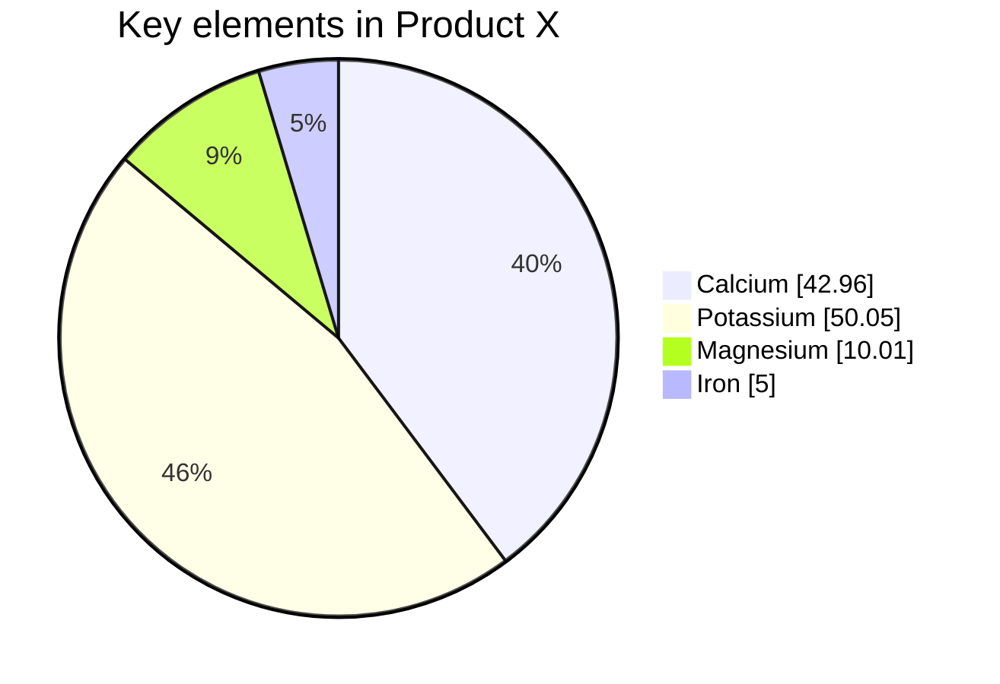
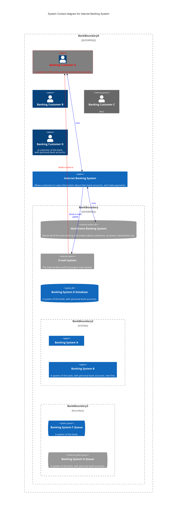
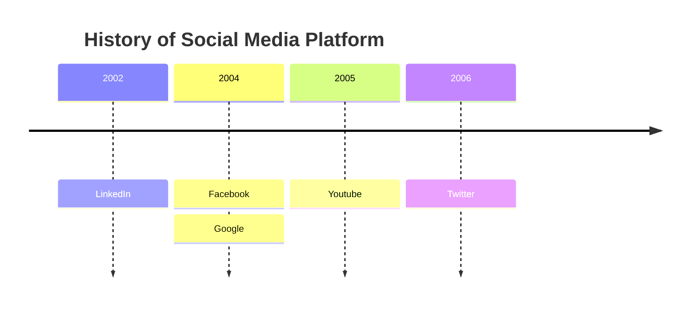

# 时序图

## 基本示例
在 PlantUML 序列图中，-> 序列表示两个参与者之间发送的消息，它是自动识别的，不需要事先声明。
通过使用--> 序列，利用虚线箭头，在您的图中提供独特的可视化。
为了提高可读性而不影响可视化表示，可使用反向箭头，如<- 或<-- 。但要注意，这是专门针对序列图的，其他图类型的规则有所不同。
	
@startuml
Alice -> Bob: Authentication Request
Bob --> Alice: Authentication Response

Alice -> Bob: Another authentication Request
Alice <-- Bob: Another authentication Response
@enduml

## 声明参与者
如果使用关键字participant 来声明参与者，就可以对该参与者进行更多的控制。
声明的顺序将是（默认的）显示顺序。
使用这些其他的关键字来声明参与者，将改变参与者的表示形状。
actor（角色）
boundary（边界）
control（控制）
entity（实体）
database（数据库）
collections（集合）
queue（队列）
	
@startuml
participant Participant as Foo
actor       Actor       as Foo1
boundary    Boundary    as Foo2
control     Control     as Foo3
entity      Entity      as Foo4
database    Database    as Foo5
collections Collections as Foo6
queue       Queue       as Foo7
Foo -> Foo1 : To actor 
Foo -> Foo2 : To boundary
Foo -> Foo3 : To control
Foo -> Foo4 : To entity
Foo -> Foo5 : To database
Foo -> Foo6 : To collections
Foo -> Foo7: To queue
@enduml

使用as 关键字重命名参与者。
你也可以改变 演员或参与者的背景颜色。
	
@startuml
actor Bob #red
' The only difference between actor
'and participant is the drawing
participant Alice
participant "I have a really\nlong name" as L #99FF99
/' You can also declare:
   participant L as "I have a really\nlong name"  #99FF99
  '/

Alice->Bob: Authentication Request
Bob->Alice: Authentication Response
Bob->L: Log transaction
@enduml

您可以使用order 关键字来定制参与者的显示顺序。
	
@startuml
participant Last order 30
participant Middle order 20
participant First order 10
@enduml

## 多行定义参与者
你可以对参与者使用多行定义。
	
@startuml
participant Participant [
    =Title
    ----
    ""打算""
]

participant Bob

Participant -> Bob
@enduml

## 在参与者中使用非字母
你可以使用引号来定义参与者。 而且你可以使用as 关键字来给这些参与者一个别名。
	
@startuml
Alice -> "Bob()" : Hello
"Bob()" -> "This is very\nlong" as Long
' You can also declare:
' "Bob()" -> Long as "This is very\nlong"
Long --> "Bob()" : ok
@enduml

## 给自己发消息
参与者可以给自己发信息，
消息文字可以用\n来换行。
	
@startuml
Alice -> Alice: This is a signal to self.\nIt also demonstrates\nmultiline \ntext
@enduml

	
@startuml
Alice <- Alice: This is a signal to self.\nIt also demonstrates\nmultiline \ntext
@enduml

**

## 文本对齐
箭头上的文本对齐可以用skinparam sequenceMessageAlign，后接参数left,right或center。
你也可以使用direction或reverseDirection来根据箭头的方向对齐文本。更多细节可参考skinparam。
	
@startuml
skinparam sequenceMessageAlign right
Bob -> Alice : Request
Alice -> Bob : Response
@enduml

让响应信息显示在箭头下面
你可以使用skinparam responseMessageBelowArrow true命令，让响应信息显示在箭头下面。
	
@startuml
skinparam responseMessageBelowArrow true
Bob -> Alice : hello
Bob <- Alice : ok
@enduml

## 改变箭头样式
您可以通过以下几种方式改变箭头样式：
添加最后的x 表示丢失的信息
使用\ 或/ 而不是< 或> 只拥有箭头的底部或顶部部分
重复箭头头（例如>> 或// ）头，拥有一个薄的图纸
使用-- 而不是- 拥有一个点状箭头
在箭头头添加最后的 "o"
使用双向的箭头<->
	
@startuml
Bob ->x Alice
Bob -> Alice
Bob ->> Alice
Bob -\ Alice
Bob \\- Alice
Bob //-- Alice

Bob ->o Alice
Bob o\\-- Alice

Bob <-> Alice
Bob <->o Alice
@enduml

## 修改箭头颜色
你可以用以下记号修改箭头的颜色：
	
@startuml
Bob -[#red]> Alice : hello
Alice -[#0000FF]->Bob : ok
@enduml

## 对消息序列编号
关键字 autonumber 用于自动对消息编号。
	
@startuml
autonumber
Bob -> Alice : Authentication Request
Bob <- Alice : Authentication Response
@enduml

语句 autonumber //start// 用于指定编号的初始值，而 autonumber //start// //increment// 可以同时指定编号的初始值和每次增加的值。
	
@startuml
autonumber
Bob -> Alice : Authentication Request
Bob <- Alice : Authentication Response

autonumber 15
Bob -> Alice : Another authentication Request
Bob <- Alice : Another authentication Response

autonumber 40 10
Bob -> Alice : Yet another authentication Request
Bob <- Alice : Yet another authentication Response

@enduml

你可以在双引号内指定编号的格式。
格式是由 Java 的DecimalFormat类实现的： (0 表示数字；# 也表示数字，但默认为0)。
你也可以用 HTML 标签来制定格式。
	
@startuml
autonumber "<b>[000]"
Bob -> Alice : Authentication Request
Bob <- Alice : Authentication Response

autonumber 15 "<b>(<u>##</u>)"
Bob -> Alice : Another authentication Request
Bob <- Alice : Another authentication Response

autonumber 40 10 "<b>Message 0  "
Bob -> Alice : Yet another authentication Request
Bob <- Alice : Yet another authentication Response

@enduml

你还可以用语句 autonumber stop 和 autonumber resume //increment// //format// 来表示暂停或继续使用自动编号。
	
@startuml
autonumber 10 10 "<b>[000]"
Bob -> Alice : Authentication Request
Bob <- Alice : Authentication Response

autonumber stop
Bob -> Alice : dummy

autonumber resume "<b>Message 0  "
Bob -> Alice : Yet another authentication Request
Bob <- Alice : Yet another authentication Response

autonumber stop
Bob -> Alice : dummy

autonumber resume 1 "<b>Message 0  "
Bob -> Alice : Yet another authentication Request
Bob <- Alice : Yet another authentication Response
@enduml

你也可以使用一个2或3位的序列，中间采用一种或几种分隔符，如.,;,,,:。例如：1.1.1 或1.1:1 。
最后一位数字会自动递增。
要增加第一个数字，请使用：autonumber inc A 。要增加第二位数字，请使用：autonumber inc B 。
	
@startuml
autonumber 1.1.1
Alice -> Bob: Authentication request
Bob --> Alice: Response

autonumber inc A
'Now we have 2.1.1
Alice -> Bob: Another authentication request
Bob --> Alice: Response

autonumber inc B
'Now we have 2.2.1
Alice -> Bob: Another authentication request
Bob --> Alice: Response

autonumber inc A
'Now we have 3.1.1
Alice -> Bob: Another authentication request
autonumber inc B
'Now we have 3.2.1
Bob --> Alice: Response
@enduml

你也可以用autonumber 的值，带有%autonumber% 变量。
	
@startuml
autonumber 10
Alice -> Bob
note right
  the <U+0025>autonumber<U+0025> works everywhere.
  Here, its value is ** %autonumber% **
end note
Bob --> Alice: //This is the response %autonumber%//
@enduml

## 页面标题、页眉和页脚
title 关键字用于为页面添加标题。
页面可以使用header 和footer 显示页眉和页脚。
	
@startuml

header Page Header
footer Page %page% of %lastpage%

title Example Title

Alice -> Bob : message 1
Alice -> Bob : message 2

@enduml

## 分割示意图
关键字 newpage 用于把一张图分割成多张。
在 newpage 之后添加文字，作为新的示意图的标题。
这样就能很方便地在 Word 中将长图分几页打印。
	
@startuml

Alice -> Bob : message 1
Alice -> Bob : message 2

newpage

Alice -> Bob : message 3
Alice -> Bob : message 4

newpage A title for the\nlast page

Alice -> Bob : message 5
Alice -> Bob : message 6
@enduml

## 组合消息
我们可以通过以下关键词来组合消息：
alt/else
opt
loop
par
break
critical
group, 后面紧跟着消息内容
可以在标头(header)添加需要显示的文字(对于group关键字，参看下一章节 '次级分组标签')。
关键词 end 用来结束分组。
注意，分组可以嵌套使用。
	
@startuml
Alice -> Bob: 认证请求

alt 成功情况

    Bob -> Alice: 认证接受

else 某种失败情况

    Bob -> Alice: 认证失败
    group 我自己的标签
    Alice -> Log : 开始记录攻击日志
        loop 1000次
            Alice -> Bob: DNS 攻击
        end
    Alice -> Log : 结束记录攻击日志
    end

else 另一种失败

   Bob -> Alice: 请重复

end
@enduml

## 次级分组标签
对于group而言，在标头处的[和]之间可以显示次级文本或标签。
	
@startuml
Alice -> Bob: 认证请求
Bob -> Alice: 认证失败
group 我自己的标签 [我自己的标签2]
    Alice -> Log : 开始记录攻击日志
    loop 1000次
        Alice -> Bob: DNS攻击
    end
    Alice -> Log : 结束记录攻击日志
end
@enduml

[参看 QA-2503]
## 注释信息
可以使用note left 或note right 关键字在信息后面加上注释。
你可以使用end note 关键字有一个多行注释。
	
@startuml
Alice->Bob : hello
note left: this is a first note

Bob->Alice : ok
note right: this is another note

Bob->Bob : I am thinking
note left
a note
can also be defined
on several lines
end note
@enduml

## 其他的注释信息方式
可以使用note left of，note right of或note over在节点(participant)的相对位置放置注释。
还可以通过修改背景色来高亮显示注释。
以及使用关键字end note来添加多行注释。
	
@startuml
participant Alice
participant Bob
note left of Alice #aqua
This is displayed
left of Alice.
end note

note right of Alice: This is displayed right of Alice.

note over Alice: This is displayed over Alice.

note over Alice, Bob #FFAAAA: This is displayed\n over Bob and Alice.

note over Bob, Alice
This is yet another
example of
a long note.
end note
@enduml

## 改变备注框的形状 [hnote和rnote]
你可以使用 hnote 和 rnote 这两个关键字来修改备注框的形状：
hnote代表六边形（hexagonal）的备注框；
rnote代表正方形（rectangle）的备注框。
	
@startuml
caller -> server : conReq
hnote over caller : 空闲
caller <- server : conConf
rnote over server
 "r"是正方形
 "h"是六边形
endrnote
rnote over server
 多
 行
 文本
endrnote
hnote over caller
 多
 行
 文本
endhnote
@enduml

[参见 QA-1765]
## 在多个参与者添加备注 [across]
你可以之直接在所有参与者之间添加备注，格式是：
note across: 备注描述
	
@startuml
Alice->Bob:m1
Bob->Charlie:m2
note over Alice, Charlie: 创建跨越所有参与者的备注的旧方法：\n ""note over //FirstPart, LastPart//"".
note across: 新方法：\n""note across""
Bob->Alice
hnote across: 跨越所有参与者的备注。
@enduml

[参见 QA-9738]
## 在同一级对齐多个备注 [/]
使用/可以在同一级对齐多个备注：
没有/ （默认情况下，备注不是对齐的。）
	
@startuml
note over Alice : Alice的初始状态
note over Bob : Bob的初始状态
Bob -> Alice : hello
@enduml

with / (the notes are aligned)
	
@startuml
note over Alice : Alice的初始状态
/ note over Bob : Bob的初始状态
Bob -> Alice : hello
@enduml

[参见 QA-354]
## Creole和HTML
可以使用creole格式。
	
@startuml
participant Alice
participant "The **Famous** Bob" as Bob

Alice -> Bob : hello --there--
... Some ~~long delay~~ ...
Bob -> Alice : ok
note left
  This is **bold**
  This is //italics//
  This is ""monospaced""
  This is --stroked--
  This is __underlined__
  This is ~~waved~~
end note

Alice -> Bob : A //well formatted// message
note right of Alice
 This is <back:cadetblue><size:18>displayed</size></back>
 __left of__ Alice.
end note
note left of Bob
 <u:red>This</u> is <color #118888>displayed</color>
 **<color purple>left of</color> <s:red>Alice</strike> Bob**.
end note
note over Alice, Bob
 <w:#FF33FF>This is hosted</w> by 
end note
@enduml

## 分隔符
你可以通过使用==关键词来将你的图表分割成多个逻辑步骤。
	
@startuml

== 初始化 ==

Alice -> Bob: 认证请求
Bob --> Alice: 认证响应

== 重复 ==

Alice -> Bob: 认证请求
Alice <-- Bob: 认证响应

@enduml

## 引用
你可以在图中通过使用ref over关键词来实现引用
	
@startuml
participant Alice
actor Bob

ref over Alice, Bob : init

Alice -> Bob : hello

ref over Bob
  This can be on
  several lines
end ref
@enduml

## 延迟
你可以使用...来表示延迟，并且还可以给延迟添加注释。
	
@startuml

Alice -> Bob: 认证请求
...
Bob --> Alice: 认证响应
...5分钟后...
Bob --> Alice: 再见！

@enduml

## 文本换行
你可以通过手动在文本中添加\n使长文本换行。
或者使用maxMessageSize设置（此方式暂不支持中文换行）：
	
@startuml
skinparam maxMessageSize 50
participant a
participant b
a -> b :这\n一条\n是\n手动换行
a -> b :this is a very long message on several words
@enduml

## 空间
你可以使用|||来增加空间。
还可以使用数字指定增加的像素的数量。
	
@startuml

Alice -> Bob: message 1
Bob --> Alice: ok
|||
Alice -> Bob: message 2
Bob --> Alice: ok
||45||
Alice -> Bob: message 3
Bob --> Alice: ok

@enduml

## 生命线的激活与撤销
关键字activate和deactivate用来表示参与者的生命活动。
一旦参与者被激活，它的生命线就会显示出来。
activate和deactivate适用于以上情形。
destroy表示一个参与者的生命线的终结。
	
@startuml
participant User

User -> A: DoWork
activate A

A -> B: << createRequest >>
activate B

B -> C: DoWork
activate C
C --> B: WorkDone
destroy C

B --> A: RequestCreated
deactivate B

A -> User: Done
deactivate A

@enduml

还可以使用嵌套的生命线，并且运行给生命线添加颜色。
	
@startuml
participant User

User -> A: DoWork
activate A #FFBBBB

A -> A: Internal call
activate A #DarkSalmon

A -> B: << createRequest >>
activate B

B --> A: RequestCreated
deactivate B
deactivate A
A -> User: Done
deactivate A

@enduml

也可以使用自动激活关键字（autoactivate），这需要与return关键字配合：
	
@startuml
autoactivate on
alice -> bob : hello
bob -> bob : self call
bill -> bob #005500 : hello from thread 2
bob -> george ** : create
return done in thread 2
return rc
bob -> george !! : delete
return success

@enduml

## 返回
新命令return可以用于生成一个带有可选文本标签的返回信息。返回的点是导致最近一次激活生命线的点。语法是简单的返回标签，其中标签（如果提供）可以是传统信息中可以接受的任何字符串。
	
@startuml
Bob -> Alice : hello
activate Alice
Alice -> Alice : some action
return bye
@enduml

## 创建参与者
你可以把关键字create放在第一次接收到消息之前，以强调本次消息实际上是在创建新的对象。
	
@startuml
Bob -> Alice : hello

create Other
Alice -> Other : new

create control String
Alice -> String
note right : You can also put notes!

Alice --> Bob : ok

@enduml

## 激活、撤销和创建的快捷语法。
在指定目标参与者后，可以立即使用以下语法：
++ 激活目标（可选择在后面加上#color）
-- 撤销激活源
** 创建目标实例
!! 摧毁目标实例
	
@startuml
alice -> bob ++ : hello
bob -> bob ++ : self call
bob -> bib ++  #005500 : hello
bob -> george ** : create
return done
return rc
bob -> george !! : delete
return success
@enduml

然后你就可以在一行上同时激活和撤销：
	
@startuml
alice   ->  bob     ++   : hello1
bob     ->  charlie --++ : hello2
charlie --> alice   --   : ok
@enduml

	
@startuml
@startuml
alice -> bob   --++ #gold: hello
bob   -> alice --++ #gold: you too
alice -> bob   --: step1
alice -> bob   : step2
@enduml
@enduml

[参见 QA-4834, QA-9573 和 QA-13234]
## 进入和发出消息
如果只想关注部分图示，你可以使用进入和发出箭头。
使用方括号[和]表示图示的左、右两侧。
	
@startuml
[-> A: DoWork

activate A

A -> A: Internal call
activate A

A ->] : << createRequest >>

A<--] : RequestCreated
deactivate A
[<- A: Done
deactivate A
@enduml

还可以使用下面的语法:
	
@startuml
participant Alice
participant Bob #lightblue
Alice -> Bob
Bob -> Carol
...
[-> Bob
[o-> Bob
[o->o Bob
[x-> Bob
...
[<- Bob
[x<- Bob
...
Bob ->]
Bob ->o]
Bob o->o]
Bob ->x]
...
Bob <-]
Bob x<-]

@enduml

## 缩短的进入信息与发出信息箭头
使用?来显示缩短的箭头。
	
@startuml
?-> Alice    : ""?->""\n**short** to actor1
[-> Alice    : ""[->""\n**from start** to actor1
[-> Bob      : ""[->""\n**from start** to actor2
?-> Bob      : ""?->""\n**short** to actor2
Alice ->]    : ""->]""\nfrom actor1 **to end**
Alice ->?    : ""->?""\n**short** from actor1
Alice -> Bob : ""->"" \nfrom actor1 to actor2
@enduml

## 锚点和持续时间
使用teoz在图表中添加锚点，从而指定持续时间。
	
@startuml
!pragma teoz true

{start} Alice -> Bob : start doing things during duration
Bob -> Max : something
Max -> Bob : something else
{end} Bob -> Alice : finish

{start} <-> {end} : some time

@enduml

You can use the -P command-line option to specify the pragma:

java -jar plantuml.jar -Pteoz=true

## 构造类型和圈点
可以使用<<和>>给参与者添加构造类型。
在构造类型中，你可以使用(X,color)格式的语法添加一个圆圈圈起来的字符。
	
@startuml

participant "Famous Bob" as Bob << Generated >>
participant Alice << (C,#ADD1B2) Testable >>

Bob->Alice: First message

@enduml

默认使用 guillemet 字符来显示构造类型。 你可以使用外观参数 guillemet 来修改显示行为。
	
@startuml

skinparam guillemet false
participant "Famous Bob" as Bob << Generated >>
participant Alice << (C,#ADD1B2) Testable >>

Bob->Alice: First message

@enduml

@startuml

participant Bob << (C,#ADD1B2) >>
participant Alice << (C,#ADD1B2) >>

Bob->Alice: First message

@enduml

## Position of the stereotypes
It is possible to define stereotypes position (top or bottom) with the command skinparam stereotypePosition.
Top postion (by default)
	
@startuml
skinparam stereotypePosition top

participant A<<st1>>
participant B<<st2>>
A --> B : stereo test
@enduml

Bottom postion
	
@startuml
skinparam stereotypePosition bottom

participant A<<st1>>
participant B<<st2>>
A --> B : stereo test
@enduml

## 更多标题信息
你可以在标题中使用creole格式。
	
@startuml

title __Simple__ **communication** example

Alice -> Bob: Authentication Request
Bob -> Alice: Authentication Response

@enduml

在标题描述中使用\n表示换行。

	
@startuml

title __Simple__ communication example\non several lines

Alice -> Bob: Authentication Request
Bob -> Alice: Authentication Response

@enduml

还可以使用关键字title和end title定义多行标题。

	
@startuml

title
 <u>Simple</u> communication example
 on <i>several</i> lines and using html
 This is hosted by 
end title

Alice -> Bob: Authentication Request
Bob -> Alice: Authentication Response

@enduml

## 包裹参与者
可以使用box和end box画一个盒子将参与者包裹起来。
还可以在box关键字之后添加标题或者背景颜色。
	
@startuml

box "Internal Service" #LightBlue
participant Bob
participant Alice
end box
participant Other

Bob -> Alice : hello
Alice -> Other : hello

@enduml

WARNING This translation need to be updated. WARNING
## 移除脚注
使用hide footbox关键字移除脚注。
	
@startuml

hide footbox
title Footer removed

Alice -> Bob: Authentication Request
Bob --> Alice: Authentication Response

@enduml

## 外观参数(skinparam)
用skinparam改变字体和颜色。
可以在如下场景中使用：
在图示的定义中，
在引入的文件中，
在命令行或者ANT任务提供的配置文件中。
你也可以修改其他渲染元素，如以下示例：
	
@startuml
skinparam sequenceArrowThickness 2
skinparam roundcorner 20
skinparam maxmessagesize 60
skinparam sequenceParticipant underline

actor User
participant "First Class" as A
participant "Second Class" as B
participant "Last Class" as C

User -> A: DoWork
activate A

A -> B: Create Request
activate B

B -> C: DoWork
activate C
C --> B: WorkDone
destroy C

B --> A: Request Created
deactivate B

A --> User: Done
deactivate A

@enduml

	
@startuml
skinparam backgroundColor #EEEBDC
skinparam handwritten true

skinparam sequence {
ArrowColor DeepSkyBlue
ActorBorderColor DeepSkyBlue
LifeLineBorderColor blue
LifeLineBackgroundColor #A9DCDF

ParticipantBorderColor DeepSkyBlue
ParticipantBackgroundColor DodgerBlue
ParticipantFontName Impact
ParticipantFontSize 17
ParticipantFontColor #A9DCDF

ActorBackgroundColor aqua
ActorFontColor DeepSkyBlue
ActorFontSize 17
ActorFontName Aapex
}

actor User
participant "First Class" as A
participant "Second Class" as B
participant "Last Class" as C

User -> A: DoWork
activate A

A -> B: Create Request
activate B

B -> C: DoWork
activate C
C --> B: WorkDone
destroy C

B --> A: Request Created
deactivate B

A --> User: Done
deactivate A

@enduml

## 填充区设置
可以设定填充区的参数配置。
	
@startuml
skinparam ParticipantPadding 20
skinparam BoxPadding 10

box "Foo1"
participant Alice1
participant Alice2
end box
box "Foo2"
participant Bob1
participant Bob2
end box
Alice1 -> Bob1 : hello
Alice1 -> Out : out
@enduml

## 附录：箭头类型大全
普通箭头
	
@startuml
participant Alice as a
participant Bob   as b
a ->     b : ""->   ""
a ->>    b : ""->>  ""
a -\     b : ""-\   ""
a -\\    b : ""-\\\\""
a -/     b : ""-/   ""
a -//    b : ""-//  ""
a ->x    b : ""->x  ""
a x->    b : ""x->  ""
a o->    b : ""o->  ""
a ->o    b : ""->o  ""
a o->o   b : ""o->o ""
a <->    b : ""<->  ""
a o<->o  b : ""o<->o""
a x<->x  b : ""x<->x""
a ->>o   b : ""->>o ""
a -\o    b : ""-\o  ""
a -\\o   b : ""-\\\\o""
a -/o    b : ""-/o  ""
a -//o   b : ""-//o ""
a x->o   b : ""x->o ""
@enduml

进入信息和发出信息（使用'[', ']'）
进入信息（使用'['）
	
@startuml
participant Alice as a
participant Bob   as b
[->      b : ""[->   ""
[->>     b : ""[->>  ""
[-\      b : ""[-\   ""
[-\\     b : ""[-\\\\""
[-/      b : ""[-/   ""
[-//     b : ""[-//  ""
[->x     b : ""[->x  ""
[x->     b : ""[x->  ""
[o->     b : ""[o->  ""
[->o     b : ""[->o  ""
[o->o    b : ""[o->o ""
[<->     b : ""[<->  ""
[o<->o   b : ""[o<->o""
[x<->x   b : ""[x<->x""
[->>o    b : ""[->>o ""
[-\o     b : ""[-\o  ""
[-\\o    b : ""[-\\\\o""
[-/o     b : ""[-/o  ""
[-//o    b : ""[-//o ""
[x->o    b : ""[x->o ""
@enduml

发出信息（使用']'）
	
@startuml
participant Alice as a
participant Bob   as b
a ->]      : ""->]   ""
a ->>]     : ""->>]  ""
a -\]      : ""-\]   ""
a -\\]     : ""-\\\\]""
a -/]      : ""-/]   ""
a -//]     : ""-//]  ""
a ->x]     : ""->x]  ""
a x->]     : ""x->]  ""
a o->]     : ""o->]  ""
a ->o]     : ""->o]  ""
a o->o]    : ""o->o] ""
a <->]     : ""<->]  ""
a o<->o]   : ""o<->o]""
a x<->x]   : ""x<->x]""
a ->>o]    : ""->>o] ""
a -\o]     : ""-\o]  ""
a -\\o]    : ""-\\\\o]""
a -/o]     : ""-/o]  ""
a -//o]    : ""-//o] ""
a x->o]    : ""x->o] ""
@enduml

短进入信息和短发出信息（使用'?'）
短进入信息（使用'?'）
	
@startuml
participant Alice as a
participant Bob   as b
a ->     b : //Long long label//
?->      b : ""?->   ""
?->>     b : ""?->>  ""
?-\      b : ""?-\   ""
?-\\     b : ""?-\\\\""
?-/      b : ""?-/   ""
?-//     b : ""?-//  ""
?->x     b : ""?->x  ""
?x->     b : ""?x->  ""
?o->     b : ""?o->  ""
?->o     b : ""?->o  ""
?o->o    b : ""?o->o ""
?<->     b : ""?<->  ""
?o<->o   b : ""?o<->o""
?x<->x   b : ""?x<->x""
?->>o    b : ""?->>o ""
?-\o     b : ""?-\o  ""
?-\\o    b : ""?-\\\\o ""
?-/o     b : ""?-/o  ""
?-//o    b : ""?-//o ""
?x->o    b : ""?x->o ""
@enduml

短发出信息（使用'?'）
	
@startuml
participant Alice as a
participant Bob   as b
a ->     b : //Long long label//
a ->?      : ""->?   ""
a ->>?     : ""->>?  ""
a -\?      : ""-\?   ""
a -\\?     : ""-\\\\?""
a -/?      : ""-/?   ""
a -//?     : ""-//?  ""
a ->x?     : ""->x?  ""
a x->?     : ""x->?  ""
a o->?     : ""o->?  ""
a ->o?     : ""->o?  ""
a o->o?    : ""o->o? ""
a <->?     : ""<->?  ""
a o<->o?   : ""o<->o?""
a x<->x?   : ""x<->x?""
a ->>o?    : ""->>o? ""
a -\o?     : ""-\o?  ""
a -\\o?    : ""-\\\\o?""
a -/o?     : ""-/o?  ""
a -//o?    : ""-//o? ""
a x->o?    : ""x->o? ""
@enduml

WARNING This translation need to be updated. WARNING
## 特定外观参数
默认情况下
	
@startuml
Bob -> Alice : hello
Alice -> Bob : ok
@enduml

生命线策略
nosolid 虚线 （默认情况）
	
@startuml
skinparam lifelineStrategy nosolid
Bob -> Alice : hello
Alice -> Bob : ok
@enduml

[参见 QA-9016]

solid 实线
在时序图中使用实线生命线：skinparam lifelineStrategy solid
	
@startuml
skinparam lifelineStrategy solid
Bob -> Alice : hello
Alice -> Bob : ok
@enduml

[参见 QA-2794]
style strictuml
为了符合严格UML的标准（线头的形状必须是三角形，而不能是箭头形），你可以使用：
skinparam style strictuml
	
@startuml
skinparam style strictuml
Bob -> Alice : hello
Alice -> Bob : ok
@enduml

[参见 QA-1047]

## 隐藏孤立参与者
默认情况下会显示所有参与者。
	
@startuml
participant Alice
participant Bob
participant Carol

Alice -> Bob : hello
@enduml

可以使用hide unlinked命令来隐藏未被链接到的参与者。
	
@startuml
hide unlinked
participant Alice
participant Bob
participant Carol

Alice -> Bob : hello
@enduml

## 给分组信息着色
可以给分组信息color[着色]。
	
@startuml
Alice -> Bob: Authentication Request
alt#Gold #LightBlue Successful case
    Bob -> Alice: Authentication Accepted
else #Pink Failure
    Bob -> Alice: Authentication Rejected
end
@enduml

	
@startuml
mainframe This is a **mainframe**
Alice->Bob : Hello
@enduml

## Slanted or odd arrows
You can use the (nn) option (before or after arrow) to make the arrows slanted, where nn is the number of shift pixels.
[Available only after v1.2022.6beta+]
	
@startuml
A ->(10) B: text 10
B ->(10) A: text 10

A ->(10) B: text 10
A (10)<- B: text 10
@enduml

	
@startuml
A ->(40) B++: Rq
B -->(20) A--: Rs
@enduml

	
@startuml
!pragma teoz true
A ->(50) C: Starts\nwhen 'B' sends
& B ->(25) C: \nBut B's message\n arrives before A's
@enduml

	
@startuml
!pragma teoz true

S1 ->(30) S2: msg 1\n
& S2 ->(30) S1: msg 2

note left S1: msg\nS2 to S1
& note right S2: msg\nS1 to S2
@enduml

## Parallel messages (with teoz)
You can use the & teoz command to display parallel messages:
	
@startuml
!pragma teoz true
Alice -> Bob : hello
& Bob -> Charlie : hi
@enduml

# 用例图

## 用例
用例用圆括号括起来（两个圆括号看起来就像椭圆）。
也可以用关键字usecase来定义用例。 还可以用关键字as定义一个别名，这个别名可以在以后定义关系的时候使用。

@startuml

(First usecase)
(Another usecase) as (UC2)
usecase UC3
usecase (Last\nusecase) as UC4

@enduml

## 角色
角色用两个冒号包裹起来。
也可以用actor关键字来定义角色。 还可以用关键字as来定义一个别名，这个别名可以在以后定义关系的时候使用。
在后面的例子中，我们会看到角色的定义是可选的。

@startuml

:First Actor:
:Another\nactor: as Man2
actor Woman3
actor :Last actor: as Person1

@enduml

## 改变角色的样式
可以将角色的样式从默认的火柴人改成：
用户头像样式：skinparam actorStyle awesome
透明人样式：skinparam actorStyle hollow
火柴人 默认

@startuml
:User: --> (Use)
"Main Admin" as Admin
"Use the application" as (Use)
Admin --> (Admin the application)
@enduml

用户头像

@startuml
skinparam actorStyle awesome
:User: --> (Use)
"Main Admin" as Admin
"Use the application" as (Use)
Admin --> (Admin the application)
@enduml

透明人

@startuml
skinparam actorStyle Hollow 
:User: --> (Use)
"Main Admin" as Admin
"Use the application" as (Use)
Admin --> (Admin the application)
@enduml

## 用例描述
如果想定义跨越多行的用例描述，可以用双引号将其裹起来。
还可以使用这些分隔符：
--（横线）
..（虚线）
==（双横线）
__（下划线）
并且还可以在分隔符中间放置标题。

@startuml

usecase UC1 as "You can use
several lines to define your usecase.
You can also use separators.
--
Several separators are possible.
==
And you can add titles:
..Conclusion..
This allows large description."

@enduml

## 使用包
您可以一使用包来对角色或用例进行分组。

@startuml
left to right direction
actor Guest as g
package Professional {
  actor Chef as c
  actor "Food Critic" as fc
}
package Restaurant {
  usecase "Eat Food" as UC1
  usecase "Pay for Food" as UC2
  usecase "Drink" as UC3
  usecase "Review" as UC4
}
fc --> UC4
g --> UC1
g --> UC2
g --> UC3
@enduml

您可以使用rectangle来改变包的外观。

@startuml
left to right direction
actor "Food Critic" as fc
rectangle Restaurant {
  usecase "Eat Food" as UC1
  usecase "Pay for Food" as UC2
  usecase "Drink" as UC3
}
fc --> UC1
fc --> UC2
fc --> UC3
@enduml

## 基础示例
用箭头-->连接角色和用例。
横杠-越多，箭头越长。 通过在箭头定义的后面加一个冒号及文字的方式来添加标签。
在这个例子中，User并没有定义，而是直接拿来当做一个角色使用。

@startuml

User -> (Start)
User --> (Use the application) : A small label

:Main Admin: ---> (Use the application) : This is\nyet another\nlabel

@enduml

## 继承
如果一个角色或者用例继承于另一个，那么可以用<|--符号表示。

@startuml
:Main Admin: as Admin
(Use the application) as (Use)

User <|-- Admin
(Start) <|-- (Use)

@enduml

## 使用注释
可以用note left of , note right of , note top of , note bottom of等关键字给一个对象添加注释。
注释还可以通过note关键字来定义，然后用..连接其他对象。

@startuml
:Main Admin: as Admin
(Use the application) as (Use)

User -> (Start)
User --> (Use)

Admin ---> (Use)

note right of Admin : This is an example.

note right of (Use)
  A note can also
  be on several lines
end note

note "This note is connected\nto several objects." as N2
(Start) .. N2
N2 .. (Use)
@enduml

## 构造类型
用 << 和 >> 来定义角色或者用例的构造类型。

@startuml
User << Human >>
:Main Database: as MySql << Application >>
(Start) << One Shot >>
(Use the application) as (Use) << Main >>

User -> (Start)
User --> (Use)

MySql --> (Use)

@enduml

## 改变箭头方向
默认情况下，类之间的链接有两个破折号-- ，并且是垂直方向的。 可以通过像这样放一个破折号（或点）来使用水平链接。

@startuml
:user: --> (Use case 1)
:user: -> (Use case 2)
@enduml

你也可以通过反转链接来改变方向。

@startuml
(Use case 1) <.. :user:
(Use case 2) <- :user:
@enduml

也可以通过在箭头内添加left,right,up 或down 关键字来改变箭头方向。

@startuml
:user: -left-> (dummyLeft)
:user: -right-> (dummyRight)
:user: -up-> (dummyUp)
:user: -down-> (dummyDown)
@enduml

你可以通过只使用方向的第一个字符来缩短箭头（例如，-d- ，而不是 -down- ） 或两个第一个字符(-do-)。
请注意，你不应该滥用这个功能：Graphviz通常在没有 调整的情况下给出良好的结果。
并使用 left to right direction参数。

@startuml
left to right direction
:user: -left-> (dummyLeft)
:user: -right-> (dummyRight)
:user: -up-> (dummyUp)
:user: -down-> (dummyDown)
@enduml

## 分割图示
用newpage关键字将图示分解为多个页面。

@startuml
:actor1: --> (Usecase1)
newpage
:actor2: --> (Usecase2)
@enduml

## 从左向右方向
默认从上往下构建图示。

@startuml
top to bottom direction
user1 --> (Usecase 1)
user2 --> (Usecase 2)

@enduml

你可以用left to right direction命令改变图示方向。

@startuml

left to right direction
user1 --> (Usecase 1)
user2 --> (Usecase 2)

@enduml

## 显示参数
用skinparam改变字体和颜色。
可以在如下场景中使用：
在图示的定义中，
在引入的文件中，
在命令行或者ANT任务提供的配置文件中。
你也可以给构造的角色和用例指定特殊颜色和字体。

@startuml
skinparam handwritten true

skinparam usecase {
BackgroundColor DarkSeaGreen
BorderColor DarkSlateGray

BackgroundColor<< Main >> YellowGreen
BorderColor<< Main >> YellowGreen

ArrowColor Olive
ActorBorderColor black
ActorFontName Courier

ActorBackgroundColor<< Human >> Gold
}

User << Human >>
:Main Database: as MySql << Application >>
(Start) << One Shot >>
(Use the application) as (Use) << Main >>

User -> (Start)
User --> (Use)

MySql --> (Use)

@enduml

## 完整样例

@startuml
left to right direction
skinparam packageStyle rectangle
actor customer
actor clerk
rectangle checkout {
  customer -- (checkout)
  (checkout) .> (payment) : include
  (help) .> (checkout) : extends
  (checkout) -- clerk
}
@enduml

## 业务用例
你可以添加/ 来制作业务用例。
业务用例

@startuml

(First usecase)/
(Another usecase)/ as (UC2)
usecase/ UC3
usecase/ (Last\nusecase) as UC4

@enduml

商业行为者

@startuml

:First Actor:/
:Another\nactor:/ as Man2
actor/ Woman3
actor/ :Last actor: as Person1

@enduml

## 改变箭头的颜色和样式（内联样式）
你可以使用以下的内联式符号改变单个箭头的颜色或样式。
#color;line.[bold|dashed|dotted];text:color

@startuml
actor foo
foo --> (bar) : normal
foo --> (bar1) #line:red;line.bold;text:red  : red bold
foo --> (bar2) #green;line.dashed;text:green : green dashed 
foo --> (bar3) #blue;line.dotted;text:blue   : blue dotted
@enduml

## 改变元素的颜色和样式（内联样式）
你可以用以下符号改变单个元素的颜色或样式。
#[color|back:color];line:color;line.[bold|dashed|dotted];text:color

@startuml
actor a
actor b #pink;line:red;line.bold;text:red
usecase c #palegreen;line:green;line.dashed;text:green
usecase d #aliceblue;line:blue;line.dotted;text:blue
@enduml

## 显示 JSON 数据

@startuml
allowmixing

actor     用户
usecase   用例

json JSON {
   "水果":"苹果",
   "尺寸":"大",
   "颜色": ["红", "绿"]
}
@enduml

# 类图

## 元素声明
@startuml
abstract        abstract
abstract class  "abstract class"
annotation      annotation
circle          circle
()              circle_short_form
class           class
class           class_stereo  <<stereotype>>
diamond         diamond
<>              diamond_short_form
entity          entity
enum            enum
exception       exception
interface       interface
metaclass       metaclass
protocol        protocol
stereotype      stereotype
struct          struct
@enduml

## 类之间的关系
类之间的关系是用以下符号定义的。
关系类型	符号	绘图
泛化关系	<|--	
组合关系	*--	
聚合关系	o--	
可以用.. 来代替-- ，会显示为虚线。
示例：
@startuml
Class01 <|-- Class02
Class03 *-- Class04
Class05 o-- Class06
Class07 .. Class08
Class09 -- Class10
@enduml

@startuml
Class11 <|.. Class12
Class13 --> Class14
Class15 ..> Class16
Class17 ..|> Class18
Class19 <--* Class20
@enduml

@startuml
Class21 #-- Class22
Class23 x-- Class24
Class25 }-- Class26
Class27 +-- Class28
Class29 ^-- Class30
@enduml

## 关系上的标签
在关系之间使用标签来说明时, 使用 :后接 标签文字。
对元素的说明，你可以在每一边使用 "" 来说明.
@startuml

类01 "1" *-- "many" 类02 : 包含

类03 o-- 类04 : 聚合

类05 --> "1" 类06

@enduml

在标签的开始或结束位置添加< 或 >以表明是哪个对象作用到哪个对象上。
@startuml
class 汽车

发动机 - 汽车 : 驱动 >
汽车 *- 轮子 : 拥有 4 >
汽车 -- 人 : < 所属

@enduml

## 在元素名称和关系标签中使用非字母
如果你想在类(或枚举...)的显示名称中使用非字母，你可以：
在类定义中使用as 关键字来指定一个别名
在类名称周围加上引号""
@startuml
class "This is my class" as class1
class class2 as "It works this way too"

class2 *-- "foo/dummy" : use
@enduml

如果一个别名被分配给一个元素，文件的其余部分必须用别名而不是名称来指代该元素。
以$
开始的名称注意，以$ 开始的名称以后不能被隐藏或删除，因为hide 和remove 命令会认为该名称是$tag 而不是一个组件名称。要想以后删除这些元素，它们必须有一个别名或必须被标记。
@startuml
class $C1
class $C2 $C2
class "$C2" as dollarC2
remove $C1
remove $C2
remove dollarC2
@enduml

还要注意的是，以$ 开始的名字是有效的，但是要给这样的元素分配一个别名，必须把名字放在引号"" 之间。

## 添加方法
要声明属性和方法，你可以使用符号:，后面跟字段或方法的名称。
编译器会通过检查括号来选择方法和字段。
@startuml
Object <|-- ArrayList

Object : equals()
ArrayList : Object[] elementData
ArrayList : size()

@enduml

可用花括号{} 为所有属性和方法分组。
注意，语法对类型/名称的顺序有很大的灵活性。
@startuml
class Dummy {
  String data
  void methods()
}

class Flight {
   flightNumber : Integer
   departureTime : Date
}
@enduml

你可以使用{field}和{method}修饰符来覆盖编译器对属性和方法的默认识别。
@startuml
class Dummy {
  {field} A field (despite parentheses)
  {method} Some method
}

@enduml

## 定义能见度(可访问性)
当你定义属性或者方法时，你可以使用特殊符号定义相应条目的可访问性质。
字符	图标(属性)	图标(方法)	可访问性
-			private 私有
#			protected 受保护
~			package private 包内可见
+			public 公有
@startuml

class Dummy {
 -field1
 #field2
 ~method1()
 +method2()
}

@enduml

你可以采用命令 skinparam classAttributeIconSize 0 来展示特殊符号本身：
@startuml
skinparam classAttributeIconSize 0
class Dummy {
 -field1
 #field2
 ~method1()
 +method2()
}

@enduml

## 抽象与静态
通过修饰符{static}或者{abstract}，可以定义静态或者抽象的方法或者属性。
这些修饰符可以写在行的开始或者结束。也可以使用{classifier}这个修饰符来代替{static}.
@startuml
class Dummy {
  {static} String id
  {abstract} void methods()
}
@enduml

## 高级类体
PlantUML默认自动将方法和属性重新分组，你可以自己定义分隔符来重排方法和属性，下面的分隔符都是可用的：-- .. == __.
还可以在分隔符中添加标题：
@startuml
class Foo1 {
  You can use
  several lines
  ..
  as you want
  and group
  ==
  things together.
  __
  You can have as many groups
  as you want
  --
  End of class
}

class User {
  .. Simple Getter ..
  + getName()
  + getAddress()
  .. Some setter ..
  + setName()
  __ private data __
  int age
  -- encrypted --
  String password
}

@enduml

## 备注和版型
版型通过类关键字("<<"和">>")来定义
你可以使用note left of , note right of , note top of , note bottom of这些关键字来添加备注。
你还可以在类的声明末尾使用note left, note right,note top, note bottom来添加。
此外，单独用note这个关键字也是可以的，使用 .. 符号可以作出一条连接它与其它对象的虚线。
@startuml
class Object << general >>
Object <|--- ArrayList

note top of Object : In java, every class\nextends this one.

note "This is a floating note" as N1
note "This note is connected\nto several objects." as N2
Object .. N2
N2 .. ArrayList

class Foo
note left: On last defined class

@enduml

## 备注中的更多功能
可以在注释中使用部分html标签 (See Creole expression)：
<b>
<u>
<i>
<s>, <del>, <strike>
 or 
<color:#AAAAAA> or <color:colorName>
<size:nn> to change font size
 or : the file must be accessible by the filesystem
你也可以在注释中展示多行。
你也可以在定义的class之后直接使用 note left, note right, note top, note bottom 来定义注释。
@startuml

class Foo
note left: On last defined class

note top of Foo
  In java, <size:18>every</size> <u>class</u>
  <b>extends</b>
  <i>this</i> one.
end note

note as N1
  This note is <u>also</u>
  <b><color:royalBlue>on several</color>
  <s>words</s> lines
  And this is hosted by 
end note

@enduml

## 注释属性 (field, attribute, member) 或方法
可以在属性（field、attribute、member）或方法上添加注释。
⚠ 注意
不能与top和bottom同时使用 (只支持left和right)
不能与表示命名空间的分隔符::同时使用
注释属性或方法
@startuml
class A {
{static} int counter
+void {abstract} start(int timeout)
}
note left of A::counter
  该成员已注释
end note
note right of A::start
  在 UML 注释了此方法
end note
@enduml

给同名方法注释
@startuml
class A {
{static} int counter
+void {abstract} start(int timeoutms)
+void {abstract} start(Duration timeout)
}
note left of A::counter
  该成员已注释
end note
note right of A::"start(int timeoutms)"
  这个start方法的参数是int类型
end note
note right of A::"start(Duration timeout)"
  这个start方法的参数是Duration类型
end note
@enduml

WARNING This translation need to be updated. WARNING
## 链接的注释
在定义链接之后，你可以用 note on link 给链接添加注释
如果想要改变注释相对于标签的位置，你也可以用 note left on link， note right on link， note bottom on link。（对应位置分别在label的左边，右边，下边）
@startuml

class Dummy
Dummy --> Foo : A link
note on link #red: note that is red

Dummy --> Foo2 : Another link
note right on link #blue
this is my note on right link
and in blue
end note

@enduml

## 抽象类和接口
用关键字abstract或abstract class来定义抽象类。
抽象类用斜体显示。
也可以使用interface, annotation 和 enum 等关键字。
@startuml

abstract class AbstractList
abstract AbstractCollection
interface List
interface Collection

List <|-- AbstractList
Collection <|-- AbstractCollection

Collection <|- List
AbstractCollection <|- AbstractList
AbstractList <|-- ArrayList

class ArrayList {
  Object[] elementData
  size()
}

enum TimeUnit {
  DAYS
  HOURS
  MINUTES
}

annotation SuppressWarnings

@enduml

**
WARNING This translation need to be updated. WARNING
## 隐藏属性、函数等
通过使用命令“hide/show”，你可以用参数表示类的显示方式。
基础命令是: hide empty members. 这个命令会隐藏空白的方法和属性。
除 empty members 外，你可以用:
empty fields 或者 empty attributes 空属性,
empty methods 空函数，
fields 或 attributes 隐藏字段或属性，即使是被定义了
methods 隐藏方法，即使是被定义了
members 隐藏字段 和 方法，即使是被定义了
circle 类名前带圈的，
stereotype 原型。
同样可以使用 hide 或 show 关键词，对以下内容进行设置：
class 所有类，
interface 所有接口，
enum 所有枚举，
<<foo1>> 实现 foo1 的类，
一个既定的类名。
你可以使用 show/hide 命令来定义相关规则和例外。
@startuml

class Dummy1 {
  +myMethods()
}

class Dummy2 {
  +hiddenMethod()
}

class Dummy3 <<Serializable>> {
String name
}

hide members
hide <<Serializable>> circle
show Dummy1 methods
show <<Serializable>> fields

@enduml

## 隐藏类
你也可以使用 show/hide 命令来隐藏类
如果你定义了一个大的!included 文件，且想在文件包含之后隐藏部分类，该功能会很有帮助。
@startuml

class Foo1
class Foo2

Foo2 *-- Foo1

hide Foo2

@enduml

WARNING This translation need to be updated. WARNING
## 删除类
您还可以使用remove命令来删除类。
如果您定义了一个大的 [!included file]（预处理）， 并且如果您想在 [file contains]（预处理）之后删除一些类，这可能很有用。
@startuml

class Foo1
class Foo2

Foo2 *-- Foo1

remove Foo2

@enduml

## 隐藏、删除或还原标记元素或通配符
您可以在元素上放置$tags （使用$ ），然后单独或按标记删除、隐藏或还原组件。
默认情况下，所有组件都会显示：
@startuml
class C1 $tag13
enum E1
interface I1 $tag13
C1 -- I1
@enduml

但您可以：
hide $tag13 组件：
@startuml
class C1 $tag13
enum E1
interface I1 $tag13
C1 -- I1

hide $tag13
@enduml

或remove $tag13 组件：
@startuml
class C1 $tag13
enum E1
interface I1 $tag13
C1 -- I1

remove $tag13
@enduml

或remove $tag13 and restore $tag1 组件：
@startuml
class C1 $tag13 $tag1
enum E1
interface I1 $tag13
C1 -- I1

remove $tag13
restore $tag1
@enduml

或remove * and restore $tag1 组件：
@startuml
class C1 $tag13 $tag1
enum E1
interface I1 $tag13
C1 -- I1

remove *
restore $tag1
@enduml

## 隐藏或删除未关联的类
默认情况下, 所有的类都将会展示:
@startuml
class C1
class C2
class C3
C1 -- C2
@enduml

不过你可以使用:
hide @unlinked 来隐藏未关联的类:
@startuml
class C1
class C2
class C3
C1 -- C2

hide @unlinked
@enduml

或者使用 remove @unlinked 来删除未关联的类:
@startuml
class C1
class C2
class C3
C1 -- C2

remove @unlinked
@enduml

[Adapted from QA-11052]
## 泛型（generics）
你可以用 < 和 > 来定义类的泛型。
@startuml

class Foo<? extends Element> {
  int size()
}
Foo *- Element

@enduml

It is possible to disable this drawing using skinparam genericDisplay old command.
## 指定标记（Spot）
通常标记字符 (C, I, E or A) 用于标记 类(classes), 接口（interface）, 枚举（enum）和 抽象类（abstract classes）.
但是当你想定义原型时，可以增加对应的单个字符及颜色，来定义自己的标记（spot），就像下面一样：
@startuml

class System << (S,#FF7700) Singleton >>
class Date << (D,orchid) >>
@enduml

## 包
你可以通过关键词 package 声明包，同时可选的来声明对应的背景色（通过使用html色彩代码或名称）。
注意：包可以被定义为嵌套。
@startuml

package "Classic Collections" #DDDDDD {
  Object <|-- ArrayList
}

package net.sourceforge.plantuml {
  Object <|-- Demo1
  Demo1 *- Demo2
}

@enduml

WARNING This translation need to be updated. WARNING
## 包样式
包可以定义不同的样式。
你可以通过以下的命令来设置默认样式 : skinparam packageStyle,或者对包使用对应的模板:
@startuml
scale 750 width
package foo1 <<Node>> {
  class Class1
}

package foo2 <<Rectangle>> {
  class Class2
}

package foo3 <<Folder>> {
  class Class3
}

package foo4 <<Frame>> {
  class Class4
}

package foo5 <<Cloud>> {
  class Class5
}

package foo6 <<Database>> {
  class Class6
}

@enduml

你也可以参考下面的示例来定义包之间的连线:
@startuml

skinparam packageStyle rectangle

package foo1.foo2 {
}

package foo1.foo2.foo3 {
  class Object
}

foo1.foo2 +-- foo1.foo2.foo3

@enduml

## 命名空间（Namespaces）
在使用包（package）时（区别于命名空间），类名是类的唯一标识。 也就意味着，在不同的包（package）中的类，不能使用相同的类名。
在那种情况下（译注：同名、不同全限定名类），你应该使用命名空间来取而代之。
你可以从其他命名空间，使用全限定名来引用类， 默认命名空间（译注：无名的命名空间）下的类，以一个“."开头（的类名）来引用（译注：示例中的BaseClass).
注意：你不用显示地创建命名空间：一个使用全限定名的类会自动被放置到对应的命名空间。
@startuml

class BaseClass

namespace net.dummy #DDDDDD {
    .BaseClass <|-- Person
    Meeting o-- Person

    .BaseClass <|- Meeting
}

namespace net.foo {
  net.dummy.Person  <|- Person
  .BaseClass <|-- Person

  net.dummy.Meeting o-- Person
}

BaseClass <|-- net.unused.Person

@enduml

There won't be any difference between namespaces and packages anymore: both keywords are now synonymous.
WARNING This translation need to be updated. WARNING
## 自动创建命名空间
使用命令 set namespaceSeparator ??? 你可以自定义命名空间分隔符（为 “.” 以外的字符）.
@startuml

set namespaceSeparator ::
class X1::X2::foo {
  some info
}

@enduml

禁止自动创建包则可以使用 set namespaceSeparator none.
@startuml

set namespaceSeparator none
class X1.X2.foo {
  some info
}

@enduml

WARNING This translation need to be updated. WARNING
## 棒棒糖接口
需要定义棒棒糖样式的接口时可以遵循以下语法:
bar ()- foo
bar ()-- foo
foo -() bar
@startuml
class foo类
bar ()- foo类
@enduml

## 改变箭头方向
类之间默认采用两个破折号 -- 显示出垂直 方向的线. 要得到水平方向的可以像这样使用单破折号 (或者点):
@startuml
教室 o- 学生
教室 *-- 椅子
@enduml

你也可以通过改变倒置链接来改变方向
@startuml
学生 -o 教室
椅子 --* 教室
@enduml

也可通过在箭头内部使用关键字， 例如left, right, up 或者 down，来改变方向
@startuml
foo -left-> dummyLeft
foo -right-> dummyRight
foo -up-> dummyUp
foo -down-> dummyDown
@enduml

您可以使用缩写形式来表示方向，第一个字符（例如，-d- 而不是 -down-) 或前两个字符 (-do-)。
请注意，您不应滥用此功能：Graphviz 通常无需调整即可提供良好的结果。
同时也支持 left to right direction 参数:
@startuml
left to right direction
foo -left-> dummyLeft
foo -right-> dummyRight
foo -up-> dummyUp
foo -down-> dummyDown
@enduml

WARNING This translation need to be updated. WARNING
## “关系”类
你可以在定义了两个类之间的关系后定义一个 关系类 association class 例如:
@startuml
class Student {
  Name
}
Student "0..*" - "1..*" Course
(Student, Course) .. Enrollment

class Enrollment {
  drop()
  cancel()
}
@enduml

也可以用另一种方式:
@startuml
class Student {
  Name
}
Student "0..*" -- "1..*" Course
(Student, Course) . Enrollment

class Enrollment {
  drop()
  cancel()
}
@enduml

## 同级关联(Association on same classe)
@startuml
class 站台 {
    +名称: 字符串
}

class 通道 {
    +花费: 剩余时间
}

<> 结点

通道 . 结点
结点 - "从 0..*" 站台
结点 - "到 0..* " 站台
@enduml

WARNING This translation need to be updated. WARNING
## 样式参数
用skinparam改变字体和颜色。
可以在如下场景中使用：
在图示的定义中，
在引入的文件中，
在命令行或者ANT任务提供的配置文件中。
@startuml

skinparam class {
BackgroundColor PaleGreen
ArrowColor SeaGreen
BorderColor SpringGreen
}
skinparam stereotypeCBackgroundColor YellowGreen

类01 "1" *-- "many" 类02 : 包含

类03 o-- 类04 : 聚合

@enduml

## 模板样式
你可以给模型自定义颜色和字体(You can define specific color and fonts for stereotyped classes.)
@startuml

skinparam class {
BackgroundColor PaleGreen
ArrowColor SeaGreen
BorderColor SpringGreen
BackgroundColor<<Foo>> Wheat
BorderColor<<Foo>> Tomato
}
skinparam stereotypeCBackgroundColor YellowGreen
skinparam stereotypeCBackgroundColor<< Foo >> DimGray

类1 <<Foo>>
类3 <<Foo>>
类1 "1" *-- "*" 类2 : 包含(contains)

类3 o-- 类4 : 聚合(aggregation)

@enduml

Any of the spaces shown as `_` below will cause all skinparams to be ignored, see [discord discussion](https://discord.com/channels/1083727021328306236/1289954399321329755/1289967399302467614) and [issue #1932](https://github.com/plantuml/plantuml/issues/1932):
`BackgroundColor_<<Foo>> Wheat`
`skinparam stereotypeCBackgroundColor_<<Foo>> DimGray`
WARNING This translation need to be updated. WARNING
## 渐变颜色
你可以使用 # 号为类、注释等等自定义颜色。
在自定义颜色中你可以使用标准颜色的名称 或 RGB 编码，参见: Colors.
你同样可以使用下面的语法为背景色声明为渐变的颜色:
渐变的两个颜色可以使用下面的符号分割：
|,
/,
\,
-,
他们的区别在于颜色渐变的方向不同。
例如:
@startuml

skinparam backgroundcolor AntiqueWhite/Gold
skinparam classBackgroundColor Wheat|CornflowerBlue

class 类1 #red-green
note left of 类1 #blue\9932CC
  这是foo类的
  渐变颜色
end note

package 包1 #GreenYellow/LightGoldenRodYellow {
  class 类2
}

@enduml

## 辅助布局
有时候，默认布局并不完美...
你可以使用 together 关键词将某些类进行分组： 布局引擎会尝试将它们捆绑在一起（如同在一个包(package)内)
你也可以使用建立 hidden 链接的方式来强制布局
@startuml

class Bar1
class Bar2
together {
  class Together1
  class Together2
  class Together3
}
Together1 - Together2
Together2 - Together3
Together2 -[hidden]--> Bar1
Bar1 -[hidden]> Bar2

@enduml

## 拆分大文件
有些情况下，会有一些很大的图片文件。
可以用 page (hpages)x(vpages) 这个命令把生成的图片文件拆分成若干个文件。
hpages 用来表示水平方向页面数， and vpages 用来表示垂直方面页面数。
你也可以使用特定的皮肤设定来给分页添加边框（见例子）
@startuml
' Split into 4 pages
page 2x2
skinparam pageMargin 10
skinparam pageExternalColor gray
skinparam pageBorderColor black

class BaseClass

namespace net.dummy #DDDDDD {
    .BaseClass <|-- Person
    Meeting o-- Person

    .BaseClass <|- Meeting

}

namespace net.foo {
  net.dummy.Person  <|- Person
  .BaseClass <|-- Person

  net.dummy.Meeting o-- Person
}

BaseClass <|-- net.unused.Person
@enduml

## 继承(Extends) 和 实现(implements)
同样可使用 extends 和 implements 关键词.
@startuml
class ArrayList implements List
class ArrayList extends AbstractList
@enduml

**
WARNING This translation need to be updated. WARNING
## 方括号表示关系(连接或箭头)的样式
线样式
可以明确的使用 bold, dashed, dotted, hidden 或 plain 来表示关系, 连接或箭头:
没有标签
@startuml
title 使用方括号([])表示的线样式（无标签版）

class foo类
class bar类
bar类1 : [bold]  
bar类2 : [dashed]
bar类3 : [dotted]
bar类4 : [hidden]
bar类5 : [plain] 

foo类 --> bar类
foo类 -[bold]-> bar类1
foo类 -[dashed]-> bar类2
foo类 -[dotted]-> bar类3
foo类 -[hidden]-> bar类4
foo类 -[plain]-> bar类5
@enduml

有标签
@startuml
title 使用方括号([])表示的线样式（有标签版）

class foo类
class bar类
bar类1 : [bold]  
bar类2 : [dashed]
bar类3 : [dotted]
bar类4 : [hidden]
bar类5 : [plain] 

foo类 --> bar类          : ∅
foo类 -[bold]-> bar类1   : [bold]
foo类 -[dashed]-> bar类2 : [dashed]
foo类 -[dotted]-> bar类3 : [dotted]
foo类 -[hidden]-> bar类4 : [hidden]
foo类 -[plain]-> bar类5  : [plain]
@enduml

[改编自 QA-4181]
线颜色
@startuml
title 使用方括号([])表示的线颜色
class foo类
class bar类
bar类1 : [#red]
bar类2 : [#green]
bar类3 : [#blue]

foo类 --> bar类
foo类 -[#red]-> bar类1     : [#red]
foo类 -[#green]-> bar类2   : [#green]
foo类 -[#blue]-> bar类3    : [#blue]
'foo类 -[#blue;#yellow;#green]-> bar类4
@enduml

线宽度
@startuml
title 使用方括号([])表示的线宽度
class foo类
class bar类
bar类1 : [thickness=1]
bar类2 : [thickness=2]
bar类3 : [thickness=4]
bar类4 : [thickness=8]
bar类5 : [thickness=16]

foo类 --> bar类                 : ∅
foo类 -[thickness=1]-> bar类1   : [1]
foo类 -[thickness=2]-> bar类2   : [2]
foo类 -[thickness=4]-> bar类3   : [4]
foo类 -[thickness=8]-> bar类4   : [8]
foo类 -[thickness=16]-> bar类5  : [16]

@enduml

混合样式
@startuml
title 使用方括号([])表示的线混合样式
class foo类
class bar类
bar类1 : [#red,thickness=1]
bar类2 : [#red,dashed,thickness=2]
bar类3 : [#green,dashed,thickness=4]
bar类4 : [#blue,dotted,thickness=8]
bar类5 : [#blue,plain,thickness=16]

foo类 --> bar类                             : ∅
foo类 -[#red,thickness=1]-> bar类1          : [#red,1]
foo类 -[#red,dashed,thickness=2]-> bar类2   : [#red,dashed,2]
foo类 -[#green,dashed,thickness=4]-> bar类3 : [#green,dashed,4]
foo类 -[#blue,dotted,thickness=8]-> bar类4  : [blue,dotted,8]
foo类 -[#blue,plain,thickness=16]-> bar类5  : [blue,plain,16]
@enduml

## 改变关系(线和箭头)的颜色和样式(单行样式)
你可以改变表示关系的线和箭头的颜色或样式，使用下面的单行样式格式：
#color;line.[bold|dashed|dotted];text:color
@startuml
class foo类
foo类 --> bar类 : 默认
foo类 --> bar类1 #line:red;line.bold;text:red  : 红色粗线
foo类 --> bar类2 #green;line.dashed;text:green : 绿色断线
foo类 --> bar类3 #blue;line.dotted;text:blue   : 蓝色点线
@enduml

[See similar feature on deployment]
## 改变类颜色和样式 (单行样式)
你可以改变定义类的 颜色 或样式， 通过下面两种指定格式:
#color ##[style]color
第一个颜色(#color)表示背景色，然后第二个表示线的样式和颜色(##[style]color)
@startuml
abstract   抽象类
annotation 标注     #pink ##[bold]red
class      类      #palegreen ##[dashed]green
interface  接口    #aliceblue ##[dotted]blue
@enduml

#[color|back:color];header:color;line:color;line.[bold|dashed|dotted];text:color
@startuml
abstract   抽象类
annotation 标注     #pink;line:red;line.bold;text:red
class      类      #palegreen;line:green;line.dashed;text:green
interface  接口    #aliceblue;line:blue;line.dotted;text:blue
@enduml

第一个原始示例:
@startuml
class bar类 #line:green;back:lightblue
class bar类2 #lightblue;line:green

class Foo类1 #back:red;line:00FFFF
class Foo类Dashed #line.dashed:blue
class Foo类Dotted #line.dotted:blue
class Foo类Bold #line.bold
class Demo类1 #back:lightgreen|yellow;header:blue/red
@enduml

## 类成员的箭头方向(Arrows from/to class members)
@startuml
class Foo类 {
+ 字段1
+ 字段2
}

class Bar类 {
+ 字段3
+ 字段4
}

Foo类::字段1 --> Bar类::字段3 : foo
Foo类::字段2 --> Bar类::字段4 : bar
@enduml

@startuml
left to right direction

class User类 {
  id : INTEGER
  ..
  其他id : INTEGER
}

class Email类 {
  id : INTEGER
  ..
  用户_id : INTEGER
  地址 : STRING
}

User类::id *-- Email类::用户_id
@enduml

## 分组继承关系(Grouping inheritance arrow heads)
你可以用skinparam groupInheritance关键字合并泛化箭头, 后接参数合并阈值(从几个继承类时开始合并)。
GroupInheritance 1 (不合并)
@startuml
skinparam groupInheritance 1

A1 <|-- B1

A2 <|-- B2
A2 <|-- C2

A3 <|-- B3
A3 <|-- C3
A3 <|-- D3

A4 <|-- B4
A4 <|-- C4
A4 <|-- D4
A4 <|-- E4
@enduml

GroupInheritance 2 (从2个组开始合并)
@startuml
skinparam groupInheritance 2

A1 <|-- B1

A2 <|-- B2
A2 <|-- C2

A3 <|-- B3
A3 <|-- C3
A3 <|-- D3

A4 <|-- B4
A4 <|-- C4
A4 <|-- D4
A4 <|-- E4
@enduml

GroupInheritance 3 (从3个组开始合并)
@startuml
skinparam groupInheritance 3

A1 <|-- B1

A2 <|-- B2
A2 <|-- C2

A3 <|-- B3
A3 <|-- C3
A3 <|-- D3

A4 <|-- B4
A4 <|-- C4
A4 <|-- D4
A4 <|-- E4
@enduml

GroupInheritance 4 (从4个组开始合并)
@startuml
skinparam groupInheritance 4

A1 <|-- B1

A2 <|-- B2
A2 <|-- C2

A3 <|-- B3
A3 <|-- C3
A3 <|-- D3

A4 <|-- B4
A4 <|-- C4
A4 <|-- D4
A4 <|-- E4
@enduml

## Display JSON Data on Class or Object diagram
Simple example
@startuml
class Class
object Object
json JSON {
   "fruit":"Apple",
   "size":"Large",
   "color": ["Red", "Green"]
}
@enduml

For another example, see on JSON page.
## Packages and Namespaces Enhancement
[From V1.2023.2+, and V1.2023.5]
@startuml
class A.B.C.D.Z {
}
@enduml

@startuml
set separator none
class A.B.C.D.Z {
}
@enduml

@startuml
!pragma useIntermediatePackages false
class A.B.C.D.Z {
}
@enduml

@startuml
set separator none
package A.B.C.D {
  class Z {
  }
}
@enduml

## Qualified associations
Minimal example
@startuml
class class1
class class2

class1 [Qualifier] - class2
@enduml

Another example
@startuml
    interface Map<K,V>
    class HashMap<Long,Customer>

    Map <|.. HashMap
    Shop [customerId: long] ---> "customer\n1" Customer
    HashMap [id: Long] -r-> "value" Customer
@enduml

## Change diagram orientation
You can change (whole) diagram orientation with:
top to bottom direction (by default)
left to right direction
Top to bottom (by default)
With Graphviz (layout engine by default)
The main rule is: Nested element first, then simple element.
@startuml
class a
class b
package A {
  class a1
  class a2
  class a3
  class a4
  class a5
  package sub_a {
   class sa1
   class sa2
   class sa3
  }
}
  
package B {
  class b1
  class b2
  class b3
  class b4
  class b5
  package sub_b {
   class sb1
   class sb2
   class sb3
  }
}
@enduml

With Smetana (internal layout engine)
The main rule is the opposite: Simple element first, then nested element.
@startuml
!pragma layout smetana
class a
class b
package A {
  class a1
  class a2
  class a3
  class a4
  class a5
  package sub_a {
   class sa1
   class sa2
   class sa3
  }
}
  
package B {
  class b1
  class b2
  class b3
  class b4
  class b5
  package sub_b {
   class sb1
   class sb2
   class sb3
  }
}
@enduml

Left to right
With Graphviz (layout engine by default)
@startuml
left to right direction
class a
class b
package A {
  class a1
  class a2
  class a3
  class a4
  class a5
  package sub_a {
   class sa1
   class sa2
   class sa3
  }
}
  
package B {
  class b1
  class b2
  class b3
  class b4
  class b5
  package sub_b {
   class sb1
   class sb2
   class sb3
  }
}
@enduml

With Smetana (internal layout engine)
@startuml
!pragma layout smetana
left to right direction
class a
class b
package A {
  class a1
  class a2
  class a3
  class a4
  class a5
  package sub_a {
   class sa1
   class sa2
   class sa3
  }
}
  
package B {
  class b1
  class b2
  class b3
  class b4
  class b5
  package sub_b {
   class sb1
   class sb2
   class sb3
  }
}
@enduml

# 活动图

程。
## 简单活动图
活动标签(activity label)以冒号开始，以分号结束。
文本格式支持creole wiki语法。
活动默认按照它们定义的顺序进行自动连接。
	
@startuml
:Hello world;
:This is defined on
several **lines**;
@enduml

## 开始/停止/结束
你可以使用start 和stop 关键字来表示一个图的开始和结束 。
	
@startuml
start
:Hello world;
:This is defined on
several **lines**;
stop
@enduml

你也可以使用end 关键字。
	
@startuml
start
:Hello world;
:This is defined on
several **lines**;
end
@enduml

## 条件
你可以使用if,then, break和else 关键词来在你的图表中放入测试。 标签可以用圆括号提供。
有3种语法可供选择。
if (...) then (...)
	
@startuml

start

if (Graphviz installed?) then (yes)
  :process all\ndiagrams;
else (no)
  :process only
  __sequence__ and __activity__ diagrams;
endif

stop

@enduml

if (...) is (...) then
	
@startuml
if (color?) is (<color:red>red) then
:print red;
else 
:print not red;
@enduml

if (...) equals (...) then
	
@startuml
if (counter?) equals (5) then
:print 5;
else 
:print not 5;
@enduml

几个测试（水平模式）
你可以使用elseif 关键字来拥有几个测试（默认是水平模式）。
	
@startuml
start
if (condition A) then (yes)
  :Text 1;
elseif (condition B) then (yes)
  :Text 2;
  stop
(no) elseif (condition C) then (yes)
  :Text 3;
(no) elseif (condition D) then (yes)
  :Text 4;
else (nothing)
  :Text else;
endif
stop
@enduml

几个测试（垂直模式）
你可以使用!pragma useVerticalIf on 命令，让测试处于垂直模式。
	
@startuml
!pragma useVerticalIf on
start
if (condition A) then (yes)
  :Text 1;
elseif (condition B) then (yes)
  :Text 2;
  stop
elseif (condition C) then (yes)
  :Text 3;
elseif (condition D) then (yes)
  :Text 4;
else (nothing)
  :Text else;
endif
stop
@enduml

你可以使用-P command-line[命令行]选项来指定pragma。

java -jar plantuml.jar -PuseVerticalIf=on

## Switch判断 [switch, case, endswitch]
你可以使用 switch, case 和 endswitch 关键词在图表中绘制Switch判断.
使用括号表示标注.
	
@startuml
start
switch (测试?)
case ( 条件 A )
  :Text 1;
case ( 条件 B ) 
  :Text 2;
case ( 条件 C )
  :Text 3;
case ( 条件 D )
  :Text 4;
case ( 条件 E )
  :Text 5;
endswitch
stop
@enduml

## 条件判断和终止 [kill, detach]
你可以在if判断中终止一个行为.
	
@startuml
if (条件?) then
  :错误;
  stop
endif
#palegreen:行为;
@enduml

但如果你想在特定行为上停止，你可以使用kill 或 detach关键字:
kill
	
@startuml
if (条件?) then
  #pink:错误;
  kill
endif
#palegreen:行为;
@enduml

detach
	
@startuml
if (条件?) then
  #pink:错误;
  detach
endif
#palegreen:行为;
@enduml

## 重复循环
你可以使用关键字repeat和repeatwhile进行重复循环。
	
@startuml

start

repeat
  :读取数据;
  :生成图片;
repeat while (更多数据?)

stop

@enduml

你同样可以使用一个全局行为作为repeat目标， 在返回循环开始时使用backward关键字插入一个全局行为。
	
@startuml

start

repeat :foo作为开始标注;
  :读取数据;
  :生成图片;
backward:这是一个后撤行为;
repeat while (更多数据?)

stop

@enduml

WARNING This translation need to be updated. WARNING
## 打断循环 [break]
你可以使用 break 关键字跟在循环中的某个行为后面打断循环.
	
@startuml
start
repeat
  :测试某事;
    if (发生错误?) then (没有)
      #palegreen:好的;
      break
    endif
    ->not ok;
    :弹窗 "文本过长错误";
repeat while (某事发生文本过长错误?) is (是的) not (不是)
->//合并步骤//;
:弹窗 "成功！";
stop
@enduml

## Goto和标签处理 [label, goto]
⚠ 目前只是实验性的 🚧
你可以使用label 和goto 关键词来表示Goto处理，其中：
label <label_name>
goto <label_name>
	
@startuml
title Point two queries to same activity\nwith `goto`
start
if (Test Question?) then (yes)
'space label only for alignment
label sp_lab0
label sp_lab1
'real label
label lab
:shared;
else (no)
if (Second Test Question?) then (yes)
label sp_lab2
goto sp_lab1
else
:nonShared;
endif
endif
:merge;
@enduml

 。
## while循环
可以使用关键字while和end while进行while循环。
	
@startuml

start

while (data available?)
  :read data;
  :generate diagrams;
endwhile

stop

@enduml

还可以在关键字endwhile后添加标注，还有一种方式是使用关键字is。
	
@startuml
while (check filesize ?) is (not empty)
  :read file;
endwhile (empty)
:close file;
@enduml

如果你使用 +detach+ 来形成一个无限循环, 那么你可能需要使用 +-[hidden]->+ 来隐藏一些不完整的箭头。
	
@startuml
:Step 1;
if (condition1) then
  while (loop forever)
   :Step 2;
  endwhile
  -[hidden]->
  detach
else
  :end normally;
  stop
endif
@enduml

WARNING This translation need to be updated. WARNING
## 并行处理 [fork, fork again, end fork, end merge]
你可以使用fork，fork again和end fork 或者 end merge 等关键字表示并行处理。
fork 示例
	
@startuml
start
fork
  :行为 1;
fork again
  :行为 2;
end fork
stop
@enduml

fork 和合并示例
	
@startuml
start
fork
  :行为 1;
fork again
  :行为 2;
end merge
stop
@enduml

	
@startuml
start
fork
  :行为 1;
fork again
  :行为 2;
fork again
  :行为 3;
fork again
  :行为 4;
end merge
stop
@enduml

	
@startuml
start
fork
  :行为 1;
fork again
  :行为 2;
  end
end merge
stop
@enduml

end fork 标注 (或 UML 连接规范):
	
@startuml
start
fork
  :行为 A;
fork again
  :行为 B;
end fork {或}
stop
@enduml

	
@startuml
start
fork
  :行为 A;
fork again
  :行为 B;
end fork {和}
stop
@enduml

其他示例
	
@startuml

start

if (多进程处理?) then (是)
  fork
    :进程 1;
  fork again
    :进程 2;
  end fork
else (否)
  :逻辑 1;
  :逻辑 2;
endif

@enduml

## 分割处理
分割
你可以使用 split, split again 和 end split 关键字去表达分割处理
	
@startuml
start
split
   :A;
split again
   :B;
split again
   :C;
split again
   :a;
   :b;
end split
:D;
end
@enduml

输入分割 (多个入口)
你可以使用包含 hidden 指令的箭头去制造一个输入分割 (多入口):
	
@startuml
split
   -[hidden]->
   :A;
split again
   -[hidden]->
   :B;
split again
   -[hidden]->
   :C;
end split
:D;
@enduml

	
@startuml
split
   -[hidden]->
   :A;
split again
   -[hidden]->
   :a;
   :b;
split again
   -[hidden]->
   (Z)
end split
:D;
@enduml

输出分割 (多个结束点)
你可以使用 kill 或 detach 去制造一个输出分割 (多个结束点):
	
@startuml
start
split
   :A;
   kill
split again
   :B;
   detach
split again
   :C;
   kill
end split
@enduml

	
@startuml
start
split
   :A;
   kill
split again
   :b;
   :c;
   detach
split again
   (Z)
   detach
split again
   end
split again
   stop
end split
@enduml

## 注释
文本格式可以使用克里奥尔维基语法。
可以使用floating 关键字浮动注释。
	
@startuml

start
:foo1;
floating note left: This is a note
:foo2;
note right
  This note is on several
  //lines// and can
  contain <b>HTML</b>
  ====
  * Calling the method ""foo()"" is prohibited
end note
stop

@enduml

您可以为后向活动添加注释：
	
@startuml
start
repeat :Enter data;
:Submit;
backward :Warning;
note right: Note
repeat while (Valid?) is (No) not (Yes)
stop
@enduml

可以添加分区活动注释：
	
@startuml
start
partition "**process** HelloWorld" {
    note
        This is my note
        ----
        //Creole test//
    end note
    :Ready;
    :HelloWorld(i)>
    :Hello-Sent;
}
@enduml

[参考QA-2398］

## 改变颜色
你可以为一些活动指定颜色
	
@startuml

start
:开始处理;
#HotPink:读取配置文件
这些文件应该在此处编辑;
#AAAAAA:结束处理;

@enduml

你通用可以使用 渐变色.
	
@startuml
start
partition #red/white test分片 {
        #blue\green:test活动;
}
@enduml

## 无箭头连接线
您可以使用 skinparam ArrowHeadColor none 参数来表示仅使用线条连接活动，而不带箭头。
	
@startuml
skinparam ArrowHeadColor none
start
:Hello world;
:This is on defined on
several **lines**;
stop
@enduml

	
@startuml
skinparam ArrowHeadColor none
start
repeat :Enter data;
:Submit;
backward :Warning;
repeat while (Valid?) is (No) not (Yes)
stop
@enduml

## 箭头
使用->标记，你可以给箭头添加文字或者修改箭头颜色。
同时，你也可以选择点状 (dotted)，条状(dashed)，加粗或者是隐式箭头
	
@startuml
:foo1;
-> You can put text on arrows;
if (test) then
  -[#blue]->
  :foo2;
  -[#green,dashed]-> The text can
  also be on several lines
  and **very** long...;
  :foo3;
else
  -[#black,dotted]->
  :foo4;
endif
-[#gray,bold]->
:foo5;
@enduml

## 连接器(Connector)
你可以使用括号定义连接器。
	
@startuml
start
:Some activity;
(A)
detach
(A)
:Other activity;
@enduml

## 连接器颜色
你可以在连接器上增加 颜色
	
@startuml
start
:下面的连接器
应该是蓝色;
#blue:(B)
:下一个连接器应该
看起来应该是
深绿色;
#green:(G)
stop
@enduml

## 组合(grouping)
通过定义分组(group)，你可以把多个活动分组。
	
@startuml
start
group 初始化分组 
    :read config file;
    :init internal variable;
end group
group 运行分组
    :wait for user interaction;
    :print information;
end group

stop
@enduml

分区
通过定义分区(partition)，你可以把多个活动组合(group)在一起:
	
@startuml
start
partition 初始化分区 {
    :read config file;
    :init internal variable;
}
partition 运行分区 {
    :wait for user interaction;
    :print information;
}

stop
@enduml

这里同样可以改变分区颜色 color:
	
@startuml
start
partition #lightGreen "Input Interface" {
    :read config file;
    :init internal variable;
}
partition Running {
    :wait for user interaction;
    :print information;
}
stop
@enduml

同样可以添加一个 链接 到分区:
	
@startuml
start
partition "[[http://plantuml.com partition_name]]" {
    :read doc. on [[http://plantuml.com plantuml_website]];
    :test diagram;
}
end
@enduml

分组, 分区, 包, 矩形 或 卡片式
你可以分组活动通过定义:
group;
partition;
package;
rectangle;
card.
	
@startuml
start
group 分组
  :Activity;
end group
floating note: 分组备注

partition 分区 {
  :Activity;
}
floating note: 分区备注

package 包 {
  :Activity;
}
floating note: 包备注

rectangle 矩形 {
  :Activity;
}
floating note: 矩形备注

card 卡片式 {
  :Activity;
}
floating note: 卡片式备注
end
@enduml

## 泳道(Swimlanes)
你可以使用管道符|来定义泳道。
还可以改变泳道的颜色。
	
@startuml
|Swimlane1|
start
:foo1;
|#AntiqueWhite|Swimlane2|
:foo2;
:foo3;
|Swimlane1|
:foo4;
|Swimlane2|
:foo5;
stop
@enduml

你可以在泳道中增加 if 判断或 repeat 或 while 循环.
	
@startuml
|#pink|Actor_For_red|
start
if (color?) is (red) then
#pink:**action red**;
:foo1;
else (not red)
|#lightgray|Actor_For_no_red|
#lightgray:**action not red**;
:foo2;
endif
|Next_Actor|
#lightblue:foo3;
:foo4;
|Final_Actor|
#palegreen:foo5;
stop
@enduml

你同样可以在泳道中增加别名，使用 alias 语法:
|[#<color>|]<swimlane_alias>| <swimlane_title>
	
@startuml
|#palegreen|f| fisherman
|c| cook
|#gold|e| eater
|f|
start
:go fish;
|c|
:fry fish;
|e|
:eat fish;
stop
@enduml

## 分离(detach)
可以使用关键字detach 或 kill移除箭头。
detach
	
@startuml
 :start;
 fork
   :foo1;
   :foo2;
 fork again
   :foo3;
   detach
 endfork
 if (foo4) then
   :foo5;
   detach
 endif
 :foo6;
 detach
 :foo7;
 stop
@enduml

kill
	
@startuml
 :start;
 fork
   :foo1;
   :foo2;
 fork again
   :foo3;
   kill
 endfork
 if (foo4) then
   :foo5;
   kill
 endif
 :foo6;
 kill
 :foo7;
 stop
@enduml

## SDL（规范和描述语言）
SDL 形状名称表
名称	旧语法	定型语法
输入	<	<<input>>
输出	>	<<output>>
程序	|	<<procedure>>
加载	\	<<load>>
保存	/	<<save>>
连续	}	<<continuous>>
任务	]	<<task>>

SDL using final separator (Deprecated form)
通过更改最终; separator，可以为活动设置不同的渲染：
|
<
>
/
\\
]
}
	
@startuml
:Ready;
:next(o)|
:Receiving;
split
 :nak(i)<
 :ack(o)>
split again
 :ack(i)<
 :next(o)
 on several lines|
 :i := i + 1]
 :ack(o)>
split again
 :err(i)<
 :nak(o)>
split again
 :foo/
split again
 :bar\\
split again
 :i > 5}
stop
end split
:finish;
@enduml

使用正态分隔符和立体原型的 SDL（当前正式形式）
	
@startuml
start
:SDL Shape;
:input; <<input>>
:output; <<output>>
:procedure; <<procedure>>
:load; <<load>>
:save; <<save>>
:continuous; <<continuous>>
:task; <<task>>
end
@enduml

	
@startuml
:Ready;
:next(o); <<procedure>>
:Receiving;
split
 :nak(i); <<input>>
 :ack(o); <<output>>
split again
 :ack(i); <<input>>
 :next(o)
 on several lines; <<procedure>>
 :i := i + 1; <<task>>
 :ack(o); <<output>>
split again
 :err(i); <<input>>
 :nak(o); <<output>>
split again
 :foo; <<save>>
split again
 :bar; <<load>>
split again
 :i > 5; <<continuous>>
stop
end split
:finish;
@enduml

## 一个完整的例子
	
@startuml

start
:ClickServlet.handleRequest();
:new page;
if (Page.onSecurityCheck) then (true)
  :Page.onInit();
  if (isForward?) then (no)
    :Process controls;
    if (continue processing?) then (no)
      stop
    endif

    if (isPost?) then (yes)
      :Page.onPost();
    else (no)
      :Page.onGet();
    endif
    :Page.onRender();
  endif
else (false)
endif

if (do redirect?) then (yes)
  :redirect process;
else
  if (do forward?) then (yes)
    :Forward request;
  else (no)
    :Render page template;
  endif
endif

stop

@enduml

## 判断的样式
inside 样式 (默认)
	
@startuml
skinparam conditionStyle inside
start
repeat
  :act1;
  :act2;
repeatwhile (<b>end)
:act3;
@enduml

	
@startuml
start
repeat
  :act1;
  :act2;
repeatwhile (<b>end)
:act3;
@enduml

Diamond 样式
	
@startuml
skinparam conditionStyle diamond
start
repeat
  :act1;
  :act2;
repeatwhile (<b>end)
:act3;
@enduml

InsideDiamond (或 Foo1) 样式
	
@startuml
skinparam conditionStyle InsideDiamond
start
repeat
  :act1;
  :act2;
repeatwhile (<b>end)
:act3;
@enduml

	
@startuml
skinparam conditionStyle foo1
start
repeat
  :act1;
  :act2;
repeatwhile (<b>end)
:act3;
@enduml

## 判断的结束样式
Diamond 样式 (默认)
With one branch
	
@startuml
skinparam ConditionEndStyle diamond
:A;
if (decision) then (yes)
    :B1;
else (no)
endif
:C;
@enduml

两个分支 (B1, B2)
	
@startuml
skinparam ConditionEndStyle diamond
:A;
if (decision) then (yes)
    :B1;
else (no)
    :B2;
endif
:C;
@enduml
@enduml

水平线 (hline) 样式
一个分
	
@startuml
skinparam ConditionEndStyle hline
:A;
if (decision) then (yes)
    :B1;
else (no)
endif
:C;
@enduml

两个分支 (B1, B2)
	
@startuml
skinparam ConditionEndStyle hline
:A;
if (decision) then (yes)
    :B1;
else (no)
    :B2;
endif
:C;
@enduml
@enduml

## 使用 sytle 定义 (全局) 样式
无样式 (默认)
	
@startuml
start
:init;
-> test of color;
if (color?) is (<color:red>red) then
:print red;
else 
:print not red;
note right: no color
endif
partition End {
:end;
}
-> this is the end;
end
@enduml

有样式
你可以使用 style 节点去定义样式然后改变渲染。
	
@startuml

start
:init;
-> test of color;
if (color?) is (<color:red>red) then
:print red;
else 
:print not red;
note right: no color
endif
partition End {
:end;
}
-> this is the end;
end
@enduml

# 组件图

区。
## 组件
组件必须用中括号括起来。
还可以使用关键字component定义一个组件。 并且可以用关键字as给组件定义一个别名。 这个别名可以在稍后定义关系的时候使用。

@startuml

[First component]
[Another component] as Comp2
component Comp3
component [Last\ncomponent] as Comp4

@enduml

命名例外
注意，以$ 开头的组件名以后不能隐藏或删除，因为hide 和remove 命令会将该名称视为$tag ，而不是组件名。要删除此类组件，必须为其添加别名或标记。

@startuml
component [$C1]
component [$C2] $C2
component [$C2] as dollarC2
remove $C1
remove $C2
remove dollarC2
@enduml

## 接口
接口可以使用()来定义(因为这个看起来像个圆)。
还可以使用关键字interface关键字来定义接口。 并且还可以使用关键字as定义一个别名。 这个别名可以在稍后定义关系的时候使用。
我们稍后可以看到，接口的定义是可选的。

@startuml

() "First Interface"
() "Another interface" as Interf2
interface Interf3
interface "Last\ninterface" as Interf4

@enduml

## 基础的示例
元素之间可以使用虚线(..)、直线(--)、箭头(-->)进行连接。

@startuml

DataAccess - [First Component]
[First Component] ..> HTTP : use

@enduml

## 使用注释
你可以使用 note left of , note right of , note top of , note bottom of 等关键字定义相对于对象位置的注释。
也可以使用关键字note单独定义注释，然后使用虚线(..)将其连接到其他对象。

@startuml

interface "Data Access" as DA

DA - [First Component]
[First Component] ..> HTTP : use

note left of HTTP : Web Service only

note right of [First Component]
  A note can also
  be on several lines
end note

@enduml

WARNING This translation need to be updated. WARNING
## 组合组件
你可以使用多个关键字将组件和接口组合在一起。
package
node
folder
frame
cloud
database

@startuml

package "Some Group" {
  HTTP - [First Component]
  [Another Component]
}

node "Other Groups" {
  FTP - [Second Component]
  [First Component] --> FTP
}

cloud {
  [Example 1]
}

database "MySql" {
  folder "This is my folder" {
    [Folder 3]
  }
  frame "Foo" {
    [Frame 4]
  }
}

[Another Component] --> [Example 1]
[Example 1] --> [Folder 3]
[Folder 3] --> [Frame 4]

@enduml

## 改变箭头方向
默认情况下，对象之间用--连接，并且连接是竖直的。不过可以使用一个横线或者点设置水平方向的连接，就行这样：

@startuml
[Component] --> Interface1
[Component] -> Interface2
@enduml

也可以使用反向连接：

@startuml
Interface1 <-- [Component]
Interface2 <- [Component]
@enduml

还可以使用关键字left, right, up or down改变箭头方向。

@startuml
[Component] -left-> left
[Component] -right-> right
[Component] -up-> up
[Component] -down-> down
@enduml

允许使用方向单词的首字母或者前两个字母表示方向(例如-d-, -do-, -down-都是等价的)。
请不要乱用这些功能：Graphviz(PlantUML的后端引擎)不喜欢这个样子。
_See also 'Change diagram orientation' on [Deployment diagram](deployment-diagram) page._
## 使用 UML2 标记
By default (from v1.2020.13-14), UML2 notation is used.

@startuml

interface "Data Access" as DA

DA - [First Component]
[First Component] ..> HTTP : use

@enduml

## 使用UML1标记符
命令skinparam componentStyle uml1 可以切换到UML1标记符。

@startuml
skinparam componentStyle uml1

interface "Data Access" as DA

DA - [First Component]
[First Component] ..> HTTP : use

@enduml

## Use rectangle notation (remove UML notation)
The skinparam componentStyle rectangle command is used to switch to rectangle notation (without any UML notation).

@startuml
skinparam componentStyle rectangle

interface "Data Access" as DA

DA - [First Component]
[First Component] ..> HTTP : use

@enduml

## 长描述
可以用方括号"[ ]"在连线上添加描述。

@startuml
component comp1 [
This component
has a long comment
on several lines
]
@enduml

## 不同的颜色表示
你可以在声明一个组件时加上颜色的声明。

@startuml
component  [Web Server] #Yellow
@enduml

## 在定型组件中使用精灵图
你可以在定型组件中使用精灵图（sprite）。

@startuml
sprite $businessProcess [16x16/16] {
FFFFFFFFFFFFFFFF
FFFFFFFFFFFFFFFF
FFFFFFFFFFFFFFFF
FFFFFFFFFFFFFFFF
FFFFFFFFFF0FFFFF
FFFFFFFFFF00FFFF
FF00000000000FFF
FF000000000000FF
FF00000000000FFF
FFFFFFFFFF00FFFF
FFFFFFFFFF0FFFFF
FFFFFFFFFFFFFFFF
FFFFFFFFFFFFFFFF
FFFFFFFFFFFFFFFF
FFFFFFFFFFFFFFFF
FFFFFFFFFFFFFFFF
}

rectangle " End to End\nbusiness process" <<$businessProcess>> {
 rectangle "inner process 1" <<$businessProcess>> as src
 rectangle "inner process 2" <<$businessProcess>> as tgt
 src -> tgt
}
@enduml

## 显示参数
用skinparam改变字体和颜色。
可以在如下场景中使用：
在图示的定义中，
在引入的文件中，
在命令行或者ANT任务提供的配置文件中。
可以为构造类型和接口定义特殊的颜色和字体。

@startuml

skinparam interface {
  backgroundColor RosyBrown
  borderColor orange
}

skinparam component {
  FontSize 13
  BackgroundColor<<Apache>> Pink
  BorderColor<<Apache>> #FF6655
  FontName Courier
  BorderColor black
  BackgroundColor gold
  ArrowFontName Impact
  ArrowColor #FF6655
  ArrowFontColor #777777
}

() "Data Access" as DA
Component "Web Server" as WS << Apache >>

DA - [First Component]
[First Component] ..> () HTTP : use
HTTP - WS

@enduml

@startuml

skinparam component {
    backgroundColor<<static_lib>> DarkKhaki
    backgroundColor<<shared_lib>> Green
}

skinparam node {
borderColor Green
backgroundColor Yellow
backgroundColor<<shared_node>> Magenta
}
skinparam databaseBackgroundColor Aqua

[AA] <<static_lib>>
[BB] <<shared_lib>>
[CC] <<static_lib>>

node node1
node node2 <<shared node>>
database Production

@enduml

WARNING This translation need to be updated. WARNING
## 特定皮肤参数
组件样式
默认情况下（或使用skinparam componentStyle uml2 ），组件有一个图标。

@startuml
skinparam BackgroundColor transparent
skinparam componentStyle uml2
component A {
   component "A.1" {
}
   component A.44 {
      [A4.1]
}
   component "A.2"
   [A.3]
   component A.5 [
A.5] 
   component A.6 [
]
}
[a]->[b]
@enduml

如果您想取消它，只使用矩形图标，可以使用skinparam componentStyle rectangle

@startuml
skinparam BackgroundColor transparent
skinparam componentStyle rectangle
component A {
   component "A.1" {
}
   component A.44 {
      [A4.1]
}
   component "A.2"
   [A.3]
   component A.5 [
A.5] 
   component A.6 [
]
}
[a]->[b]
@enduml

[参考文献10798］
## 隐藏或删除未链接的组件
默认情况下，所有的组件都显示出来：

@startuml
component C1
component C2
component C3
C1 -- C2
@enduml

但你可以：
hide @unlinked 组件：

@startuml
component C1
component C2
component C3
C1 -- C2

hide @unlinked
@enduml

或remove @unlinked 组件：

@startuml
component C1
component C2
component C3
C1 -- C2

remove @unlinked
@enduml

## Hide, Remove or Restore tagged component or wildcard
You can put $tags (using $) on components, then remove, hide or restore components either individually or by tags.
By default, all components are displayed:

@startuml
component C1 $tag13
component C2
component C3 $tag13
C1 -- C2
@enduml

But you can:
hide $tag13 components:

@startuml
component C1 $tag13
component C2
component C3 $tag13
C1 -- C2

hide $tag13
@enduml

or remove $tag13 components:

@startuml
component C1 $tag13
component C2
component C3 $tag13
C1 -- C2

remove $tag13
@enduml

or remove $tag13 and restore $tag1 components:

@startuml
component C1 $tag13 $tag1
component C2
component C3 $tag13
C1 -- C2

remove $tag13
restore $tag1
@enduml

or remove * and restore $tag1 components:

@startuml
component C1 $tag13 $tag1
component C2
component C3 $tag13
C1 -- C2

remove *
restore $tag1
@enduml

## 在组件图上显示JSON数据
简单的例子

@startuml
allowmixing

component Component
()        Interface

json JSON {
   "fruit":"Apple",
   "size":"Large",
   "color": ["Red", "Green"]
}
@enduml

关于另一个例子，请看[JSON页面](json#2fyxla9p9ob6l3t3tjre)。
## 端口 [port, portIn, portOut]
您可以用port,portin和portout 关键词添加端口。
端口

@startuml
[c]
component C {
  port p1
  port p2
  port p3
  component c1
}

c --> p1
c --> p2
c --> p3
p1 --> c1
p2 --> c1
@enduml

端口输入

@startuml
[c]
component C {
  portin p1
  portin p2
  portin p3
  component c1
}

c --> p1
c --> p2
c --> p3
p1 --> c1
p2 --> c1
@enduml

端口输出

@startuml
component C {
  portout p1
  portout p2
  portout p3
  component c1
}
[o]
p1 --> o
p2 --> o
p3 --> o
c1 --> p1
@enduml

混合使用 PortIn 和 PortOut

@startuml
[i]
component C {
  portin p1
  portin p2
  portin p3
  portout po1
  portout po2
  portout po3
  component c1
}
[o]

i --> p1
i --> p2
i --> p3
p1 --> c1
p2 --> c1
po1 --> o
po2 --> o
po3 --> o
c1 --> po1
@enduml

# 状态图

## 普通状态
使用([*])绘制状态图的起点或终点。
使用-->添加箭头。

@startuml

[*] --> State1
State1 --> [*]
State1 : this is a string
State1 : this is another string

State1 -> State2
State2 --> [*]

@enduml

## 简化状态
你可以使用隐藏空描述，即 hide empty description 关键字，渲染一个简单的状态。

@startuml
hide empty description
[*] --> 状态1
状态1 --> [*]
状态1 : 这是一段字符串
状态1 : 这是另一段字符串

状态1 -> 状态2
状态2 --> [*]
@enduml

## 复杂状态
一个状态也可能是嵌套的，必须使用关键字state和花括号来定义复杂状态。
内部子状态

@startuml
scale 350 width
[*] --> NotShooting

state NotShooting {
  [*] --> Idle
  Idle --> Configuring : EvConfig
  Configuring --> Idle : EvConfig
}

state Configuring {
  [*] --> NewValueSelection
  NewValueSelection --> NewValuePreview : EvNewValue
  NewValuePreview --> NewValueSelection : EvNewValueRejected
  NewValuePreview --> NewValueSelection : EvNewValueSaved

  state NewValuePreview {
     State1 -> State2
  }

}
@enduml

子状态间的连接

@startuml
state A {
  state X {
  }
  state Y {
  }
}
 
state B {
  state Z {
  }
}

X --> Z
Z --> Y
@enduml

WARNING This translation need to be updated. WARNING
## 长状态名
也可以使用关键字state来给状态描述较长的状态名，并定义其指代名。

@startuml
scale 600 width

[*] -> State1
State1 --> State2 : Succeeded
State1 --> [*] : Aborted
State2 --> State3 : Succeeded
State2 --> [*] : Aborted
state State3 {
  state "Accumulate Enough Data\nLong State Name" as long1
  long1 : Just a test
  [*] --> long1
  long1 --> long1 : New Data
  long1 --> ProcessData : Enough Data
}
State3 --> State3 : Failed
State3 --> [*] : Succeeded / Save Result
State3 --> [*] : Aborted

@enduml

## 历史状态 [[H], [H*]]
在嵌套状态中，你可以用 [H] 来表示历史状态， [H*] 表示深层历史状态.

@startuml
[*] -> State1
State1 --> State2 : Succeeded
State1 --> [*] : Aborted
State2 --> State3 : Succeeded
State2 --> [*] : Aborted
state State3 {
  state "Accumulate Enough Data" as long1
  long1 : Just a test
  [*] --> long1
  long1 --> long1 : New Data
  long1 --> ProcessData : Enough Data
  State2 --> [H]: Resume
}
State3 --> State2 : Pause
State2 --> State3[H*]: DeepResume
State3 --> State3 : Failed
State3 --> [*] : Succeeded / Save Result
State3 --> [*] : Aborted
@enduml

## 分支状态 [fork, join]
你可以使用版型 <<fork>> 和 <<join>> 来表示状态的分叉及合并。

@startuml

state fork_state <<fork>>
[*] --> fork_state
fork_state --> State2
fork_state --> State3

state join_state <<join>>
State2 --> join_state
State3 --> join_state
join_state --> State4
State4 --> [*]

@enduml

## 并发状态 [--, ||]
用-- or ||作为分隔符来合成并发状态。
水平分隔 --

@startuml
[*] --> Active

state Active {
  [*] -> NumLockOff
  NumLockOff --> NumLockOn : EvNumLockPressed
  NumLockOn --> NumLockOff : EvNumLockPressed
  --
  [*] -> CapsLockOff
  CapsLockOff --> CapsLockOn : EvCapsLockPressed
  CapsLockOn --> CapsLockOff : EvCapsLockPressed
  --
  [*] -> ScrollLockOff
  ScrollLockOff --> ScrollLockOn : EvCapsLockPressed
  ScrollLockOn --> ScrollLockOff : EvCapsLockPressed
}

@enduml

竖直分隔 ||

@startuml
[*] --> Active

state Active {
  [*] -> NumLockOff
  NumLockOff --> NumLockOn : EvNumLockPressed
  NumLockOn --> NumLockOff : EvNumLockPressed
  ||
  [*] -> CapsLockOff
  CapsLockOff --> CapsLockOn : EvCapsLockPressed
  CapsLockOn --> CapsLockOff : EvCapsLockPressed
  ||
  [*] -> ScrollLockOff
  ScrollLockOff --> ScrollLockOn : EvCapsLockPressed
  ScrollLockOn --> ScrollLockOff : EvCapsLockPressed
}

@enduml

**
WARNING This translation need to be updated. WARNING
## 选择结点 [choice]
版型 <<choice>>可以用来表示一个选择结点，表示状态条件。

@startuml
state "Req(Id)" as ReqId <<sdlreceive>>
state "Minor(Id)" as MinorId
state "Major(Id)" as MajorId
 
state c <<choice>>
 
Idle --> ReqId
ReqId --> c
c --> MinorId : [Id <= 10]
c --> MajorId : [Id > 10]
@enduml

## 一个使用版型的完整样例 [start, choice, fork, join, end]

@startuml
state start1  <<start>>
state choice1 <<choice>>
state fork1   <<fork>>
state join2   <<join>>
state end3    <<end>>

[*]     --> choice1 : from start\nto choice
start1  --> choice1 : from start stereo\nto choice

choice1 --> fork1   : from choice\nto fork
choice1 --> join2   : from choice\nto join
choice1 --> end3    : from choice\nto end stereo

fork1   ---> State1 : from fork\nto state
fork1   --> State2  : from fork\nto state

State2  --> join2   : from state\nto join
State1  --> [*]     : from state\nto end

join2   --> [*]     : from join\nto end
@enduml

WARNING This translation need to be updated. WARNING
## 入口和出口 [entryPoint, exitPoint]
你可以用以下版型给合成状态添加入口结点<<entryPoint>>和出口结点 <<exitPoint>>。

@startuml
state Somp {
  state entry1 <<entryPoint>>
  state entry2 <<entryPoint>>
  state sin
  entry1 --> sin
  entry2 -> sin
  sin -> sin2
  sin2 --> exitA <<exitPoint>>
}

[*] --> entry1
exitA --> Foo
Foo1 -> entry2
@enduml

WARNING This translation need to be updated. WARNING
## 引脚 [inputPin, outputPin]
你可以用以下版型添加引脚结点<<inputPin>>和 <<outputPin>>。

@startuml
state Somp {
  state entry1 <<inputPin>>
  state entry2 <<inputPin>>
  state sin
  entry1 --> sin
  entry2 -> sin
  sin -> sin2
  sin2 --> exitA <<outputPin>>
}

[*] --> entry1
exitA --> Foo
Foo1 -> entry2
@enduml

WARNING This translation need to be updated. WARNING
## 扩展 [expansionInput, expansionOutput]
你可以用以下版型添加扩展结点<<expansionInput>>和 <<expansionOutput>>。

@startuml
state Somp {
  state entry1 <<expansionInput>>
  state entry2 <<expansionInput>>
  state sin
  entry1 --> sin
  entry2 -> sin
  sin -> sin2
  sin2 --> exitA <<expansionOutput>>
}

[*] --> entry1
exitA --> Foo
Foo1 -> entry2
@enduml

WARNING This translation need to be updated. WARNING
## 箭头方向
使用->定义水平箭头，也可以使用下列格式强制设置箭头方向：
-down-> (default arrow)
-right-> or ->
-left->
-up->

@startuml

[*] -up-> First
First -right-> Second
Second --> Third
Third -left-> Last

@enduml

可以用首字母缩写或者开始的两个字母定义方向(如, -d-，-down-和-do-是完全等价的)。

请不要滥用这些功能，Graphviz不喜欢这样。
## 更改箭头线条的颜色和风格
你可以更改线条的颜色及风格.

@startuml
State S1
State S2
S1 -[#DD00AA]-> S2
S1 -left[#yellow]-> S3
S1 -up[#red,dashed]-> S4
S1 -right[dotted,#blue]-> S5

X1 -[dashed]-> X2
Z1 -[dotted]-> Z2
Y1 -[#blue,bold]-> Y2
@enduml

## 注释
可以用 note left of, note right of, note top of, note bottom of 关键字来定义注释。
还可以定义多行注释。

@startuml

[*] --> Active
Active --> Inactive

note left of Active : this is a short\nnote

note right of Inactive
  A note can also
  be defined on
  several lines
end note

@enduml

以及浮动注释。

@startuml

state foo
note "This is a floating note" as N1

@enduml

## 在箭头上添加注释
你可以在连接箭头上使用 note on link 关键字来添加注释.

@startuml
[*] -> State1
State1 --> State2
note on link 
  this is a state-transition note 
end note
@enduml

## 给复杂状态添加注释
可以给嵌套的状态添加注释。

@startuml

[*] --> NotShooting

state "Not Shooting State" as NotShooting {
  state "Idle mode" as Idle
  state "Configuring mode" as Configuring
  [*] --> Idle
  Idle --> Configuring : EvConfig
  Configuring --> Idle : EvConfig
}

note right of NotShooting : This is a note on a composite state

@enduml

## 颜色

@startuml
state CurrentSite #pink {
    state HardwareSetup #lightblue {
       state Site #brown
        Site -[hidden]-> Controller
        Controller -[hidden]-> Devices
    }
    state PresentationSetup{
        Groups -[hidden]-> PlansAndGraphics
    }
    state Trends #FFFF77
    state Schedule #magenta
    state AlarmSupression
}
@enduml

## 显示参数
用skinparam改变字体和颜色。
可以在如下场景中使用：
在图示的定义中，
在导入的文件中，
在命令行或者ANT任务提供的配置文件中。
还可以为状态的构造类型指定特殊的字体和颜色。

@startuml
skinparam backgroundColor LightYellow
skinparam state {
  StartColor MediumBlue
  EndColor Red
  BackgroundColor Peru
  BackgroundColor<<Warning>> Olive
  BorderColor Gray
  FontName Impact
}

[*] --> NotShooting

state "Not Shooting State" as NotShooting {
  state "Idle mode" as Idle <<Warning>>
  state "Configuring mode" as Configuring
  [*] --> Idle
  Idle --> Configuring : EvConfig
  Configuring --> Idle : EvConfig
}

NotShooting --> [*]
@enduml

状态图所有显示参数测试

@startuml
skinparam State {
  AttributeFontColor blue
  AttributeFontName serif
  AttributeFontSize  9
  AttributeFontStyle italic
  BackgroundColor palegreen
  BorderColor violet
  EndColor gold
  FontColor red
  FontName Sanserif
  FontSize 15
  FontStyle bold
  StartColor silver
}

state A : a a a\na
state B : b b b\nb

[*] -> A  : start
A -> B : a2b
B -> [*] : end
@enduml

## Changing style
You can change style.

@startuml

[*] --> NotShooting

state "Not Shooting State" as NotShooting {
  state "Idle mode" as Idle <<Warning>>
  state "Configuring mode" as Configuring
  [*] --> Idle
  Idle --> Configuring : EvConfig
  Configuring --> Idle : EvConfig
}

NotShooting --> [*]
@enduml

@startuml

state state1
state state2 
state choice1 <<choice>>
state end3    <<end>>

state1  --> choice1 : 1
choice1 --> state2  : 2
choice1 --> end3    : 3
@enduml

## Change state color and style (inline style)
You can change the color or style of individual state using the following notation:
#color ##[style]color
With background color first (#color), then line style and line color (##[style]color ).

@startuml
state FooGradient #red-green ##00FFFF
state FooDashed #red|green ##[dashed]blue {
}
state FooDotted ##[dotted]blue {
}
state FooBold ##[bold] {
}
state Foo1 ##[dotted]green {
state inner1 ##[dotted]yellow
}

state out ##[dotted]gold

state Foo2 ##[bold]green {
state inner2 ##[dotted]yellow
}
inner1 -> inner2
out -> inner2
@enduml

#color;line:color;line.[bold|dashed|dotted];text:color
FIXME 🚩 text:color seems not to be taken into account FIXME

@startuml
@startuml
state FooGradient #red-green;line:00FFFF
state FooDashed #red|green;line.dashed;line:blue {
}
state FooDotted #line.dotted;line:blue {
}
state FooBold #line.bold {
}
state Foo1 #line.dotted;line:green {
state inner1 #line.dotted;line:yellow
}

state out #line.dotted;line:gold

state Foo2 #line.bold;line:green {
state inner2 #line.dotted;line:yellow
}
inner1 -> inner2
out -> inner2
@enduml
@enduml

@startuml
state s1 : s1 description
state s2 #pink;line:red;line.bold;text:red : s2 description
state s3 #palegreen;line:green;line.dashed;text:green : s3 description
state s4 #aliceblue;line:blue;line.dotted;text:blue   : s4 description
@enduml

[Adapted from QA-3770]
## 别名
有了State，你可以使用alias ，比如。

@startuml
state alias1 
state "alias2"
state "long name" as alias3
state alias4 as "long name"

alias1 : ""state alias1""
alias2 : ""state "alias2"""
alias3 : ""state "long name" as alias3""
alias4 : ""state alias4 as "long name"""

alias1 -> alias2
alias2 -> alias3
alias3 -> alias4
@enduml

或。

@startuml
state alias1 : ""state alias1""
state "alias2" : ""state "alias2"""
state "long name" as alias3 : ""state "long name" as alias3""
state alias4 as "long name" : ""state alias4 as "long name"""

alias1 -> alias2
alias2 -> alias3
alias3 -> alias4
@enduml

## Display JSON Data on State diagram
Simple example

@startuml
state "A" as stateA
state "C" as stateC {
 state B
}

json jsonJ {
   "fruit":"Apple",
   "size":"Large",
   "color": ["Red", "Green"]
}
@enduml

For another example, see on JSON page.
## State description
You can add description to a state or to a composite state.

@startuml
hide empty description 

state s0

state "This is the State 1" as s1 {
  s1: State description
  state s2
  state s3: long descr.
  state s4
  s4: long descr.
}

[*] -> s0
s0 --> s2

s2 -> s3
s3 -> s4
@enduml

## Style for Nested State Body

@startuml

state MainState <<foo>> {
  state SubA
}
@enduml

# 对象图

## 对象的定义
使用关键字object定义实例。

@startuml
object 对象1
object "第 2 个对象" as o2
@enduml

WARNING This translation need to be updated. WARNING
## 对象之间的关系
对象之间的关系是用以下符号定义的。
类型	符号	图像
延伸	<|--	
组成	*--	
聚合	o--	
可以用.. 替换-- ，以获得虚线。
知道了这些规则，就有可能画出下面的图画。
可以在关系上添加一个标签，使用: ，后面是标签的文字。
对于cardinality，你可以在关系的每一侧使用双引号"" ， 。

@startuml
object Object01
object Object02
object Object03
object Object04
object Object05
object Object06
object Object07
object Object08

Object01 <|-- Object02
Object03 *-- Object04
Object05 o-- "4" Object06
Object07 .. Object08 : some labels
@enduml

## 关联对象

@startuml
object o1
object o2
diamond dia
object o3

o1  --> dia
o2  --> dia
dia --> o3
@enduml

## 添加属性
用冒号加属性名的形式声明属性。

@startuml

object user

user : name = "Dummy"
user : id = 123

@enduml

也可以用大括号批量声明属性。

@startuml

object user {
  name = "Dummy"
  id = 123
}

@enduml

## 类图中的通用特性
可见性
定义注释
使用包
美化输出内容
## Map table or associative array
You can define a map table or associative array, with map keyword and => separator.

@startuml
map CapitalCity {
 UK => London
 USA => Washington
 Germany => Berlin
}
@enduml

@startuml
map "Map **Contry => CapitalCity**" as CC {
 UK => London
 USA => Washington
 Germany => Berlin
}
@enduml

@startuml
map "map: Map<Integer, String>" as users {
 1 => Alice
 2 => Bob
 3 => Charlie
}
@enduml

And add link with object.

@startuml
object London

map CapitalCity {
 UK *-> London
 USA => Washington
 Germany => Berlin
}
@enduml

@startuml
object London
object Washington
object Berlin
object NewYork

map CapitalCity {
 UK *-> London
 USA *--> Washington
 Germany *---> Berlin
}

NewYork --> CapitalCity::USA
@enduml

@startuml
package foo {
    object baz
}

package bar {
    map A {
        b *-> foo.baz
        c =>
    }
}

A::c --> foo
@enduml

@startuml
object Foo
map Bar {
  abc=>
  def=>
}
object Baz

Bar::abc --> Baz : Label one
Foo --> Bar::def : Label two
@enduml

## 程序（或项目）评估和审查技术（PERT）与地图
你可以使用map table ，以制作程序（或项目）评估和审查技术（PERT）图。

@startuml PERT
left to right direction
' Horizontal lines: -->, <--, <-->
' Vertical lines: ->, <-, <->
title PERT: Project Name

map Kick.Off {
}
map task.1 {
    Start => End
}
map task.2 {
    Start => End
}
map task.3 {
    Start => End
}
map task.4 {
    Start => End
}
map task.5 {
    Start => End
}
Kick.Off --> task.1 : Label 1
Kick.Off --> task.2 : Label 2
Kick.Off --> task.3 : Label 3
task.1 --> task.4
task.2 --> task.4
task.3 --> task.4
task.4 --> task.5 : Label 4
@enduml

## Display JSON Data on Class or Object diagram
Simple example

@startuml
class Class
object Object
json JSON {
   "fruit":"Apple",
   "size":"Large",
   "color": ["Red", "Green"]
}
@enduml

# 部署图

。
## 声明元素
	
@startuml
actor actor
agent agent
artifact artifact
boundary boundary
card card
cloud cloud
component component
control control
database database
entity entity
file file
folder folder
frame frame
interface  interface
node node
package package
queue queue
stack stack
rectangle rectangle
storage storage
usecase usecase
@enduml

可选的，您可以使用方括号 [] 放置长描述文本。
	
@startuml
folder folder [
这是个 <b>文件夹
----
您可以使用
====
不同类型
....
的分隔符
]

node node [
这是个 <b>结点
----
您可以使用
====
不同类型
....
的分隔符
]

database database [
这是个 <b>数据库
----
您可以使用
====
不同类型
....
的分隔符
]

usecase usecase [
这是个 <b>用例
----
您可以使用
====
不同类型
....
的分隔符
]

@enduml

WARNING This translation need to be updated. WARNING
## 声明元素（使用简短的形式）
我们可以使用一些简短的形式声明元素。
长格式关键词	短格式关键词	长表示例	短格式的例子	参考文献。
actor	: a :	actor actor1	:actor2:	Actors
component	[ c ]	component component1	[component2]	组件
interface	() i	interface interface1	() "interface2"	接口
usecase	( u )	usecase usecase1	(usecase2)	用例
Actor
	
@startuml

actor actor1
:actor2:

@enduml

注意：有一种旧的语法是用guillemet来表示actor的，现在已经过时了，过几天就会删除。请不要在你的图表中使用。
组件
	
@startuml

component 组件1
[组件2]

@enduml

接口
	
@startuml

interface 接口1
() "接口2"

label "//接口示例//"
@enduml

Usecase
	
@startuml

usecase usecase1
(usecase2)

@enduml

## 链接或箭头
你可以在有或没有标签的元素之间创建简单的链接。
	
@startuml

node node1
node node2
node node3
node node4
node node5
node1 -- node2 : label1
node1 .. node3 : label2
node1 ~~ node4 : label3
node1 == node5

@enduml

可以使用几种类型的链接。
	
@startuml

artifact artifact1
artifact artifact2
artifact artifact3
artifact artifact4
artifact artifact5
artifact artifact6
artifact artifact7
artifact artifact8
artifact artifact9
artifact artifact10
artifact1 --> artifact2
artifact1 --* artifact3
artifact1 --o artifact4
artifact1 --+ artifact5
artifact1 --# artifact6
artifact1 -->> artifact7
artifact1 --0 artifact8
artifact1 --^ artifact9
artifact1 --(0 artifact10

@enduml

你也可以有以下类型。
	
@startuml

cloud cloud1
cloud cloud2
cloud cloud3
cloud cloud4
cloud cloud5
cloud1 -0- cloud2
cloud1 -0)- cloud3
cloud1 -(0- cloud4
cloud1 -(0)- cloud5

@enduml

或另一个例子。
	
@startuml
actor foo1
actor foo2
foo1 <-0-> foo2
foo1 <-(0)-> foo2
 
(ac1) -le(0)-> left1
ac1 -ri(0)-> right1
ac1 .up(0).> up1
ac1 ~up(0)~> up2
ac1 -do(0)-> down1
ac1 -do(0)-> down2
 
actor1 -0)- actor2
 
component comp1
component comp2
comp1 *-0)-+ comp2
[comp3] <-->> [comp4]

boundary b1
control c1
b1 -(0)- c1

component comp1
interface interf1
comp1 #~~( interf1

:mode1actor: -0)- fooa1
:mode1actorl: -ri0)- foo1l

[component1] 0)-(0-(0 [componentC]
() component3 )-0-(0 "foo" [componentC]

[aze1] #-->> [aze2]
@enduml

⎘ 见附录上的所有类型。
## 的箭头样式
类似于括 号内的类关系（链接或箭头）样式
线条样式
也可以明确有bold,dashed,dotted,hidden 或plain 箭头：
无标签
	
@startuml
node foo
title Bracketed line style without label
foo --> bar
foo -[bold]-> bar1
foo -[dashed]-> bar2
foo -[dotted]-> bar3
foo -[hidden]-> bar4
foo -[plain]-> bar5
@enduml

带标签
	
@startuml
title Bracketed line style with label
node foo
foo --> bar          : ∅
foo -[bold]-> bar1   : [bold]
foo -[dashed]-> bar2 : [dashed]
foo -[dotted]-> bar3 : [dotted]
foo -[hidden]-> bar4 : [hidden]
foo -[plain]-> bar5  : [plain]
@enduml

[改编自QA-4181]
线条颜色
	
@startuml
title Bracketed line color
node  foo
foo --> bar
foo -[#red]-> bar1     : [#red]
foo -[#green]-> bar2   : [#green]
foo -[#blue]-> bar3    : [#blue]
foo -[#blue;#yellow;#green]-> bar4
@enduml

线条粗细
	
@startuml
title Bracketed line thickness
node foo
foo --> bar                 : ∅
foo -[thickness=1]-> bar1   : [1]
foo -[thickness=2]-> bar2   : [2]
foo -[thickness=4]-> bar3   : [4]
foo -[thickness=8]-> bar4   : [8]
foo -[thickness=16]-> bar5  : [16]
@enduml

[改编自QA-4949]
混合
	
@startuml
title Bracketed line style mix
node foo
foo --> bar                             : ∅
foo -[#red,thickness=1]-> bar1          : [#red,1]
foo -[#red,dashed,thickness=2]-> bar2   : [#red,dashed,2]
foo -[#green,dashed,thickness=4]-> bar3 : [#green,dashed,4]
foo -[#blue,dotted,thickness=8]-> bar4  : [blue,dotted,8]
foo -[#blue,plain,thickness=16]-> bar5  : [blue,plain,16]
foo -[#blue;#green,dashed,thickness=4]-> bar6  : [blue;green,dashed,4]
@enduml

## 改变箭头的颜色和样式（内联式）
你可以使用内联式以下符号改变单个箭头的颜色或样式。
#color;line.[bold|dashed|dotted];text:color
	
@startuml
node foo
foo --> bar : normal
foo --> bar1 #line:red;line.bold;text:red  : red bold
foo --> bar2 #green;line.dashed;text:green : green dashed 
foo --> bar3 #blue;line.dotted;text:blue   : blue dotted
@enduml

## 改变元素的颜色和样式（内联样式）
你可以用以下符号改变单个元素的颜色或样式。
#[color|back:color];line:color;line.[bold|dashed|dotted];text:color
	
@startuml
agent a
cloud c #pink;line:red;line.bold;text:red
file  f #palegreen;line:green;line.dashed;text:green
node  n #aliceblue;line:blue;line.dotted;text:blue
@enduml

	
@startuml
agent a
cloud c #pink;line:red;line.bold;text:red [
c
cloud description
]
file  f #palegreen;line:green;line.dashed;text:green {
[c1]
[c2]
}
frame frame {
node  n #aliceblue;line:blue;line.dotted;text:blue
}
@enduml

## 可嵌套的元素
这里是可嵌套的元素。
	
@startuml
artifact artifact {
}
card card {
}
cloud cloud {
}
component component {
}
database database {
}
file file {
}
folder folder {
}
frame frame {
}
hexagon hexagon {
}
node node {
}
package package {
}
queue queue {
}
rectangle rectangle {
}
stack stack {
}
storage storage {
}
@enduml

WARNING This translation need to be updated. WARNING
## 包和嵌套元素
一层的例子
	
@startuml
artifact    artifactVeryLOOOOOOOOOOOOOOOOOOOg    as "artifact" {
file f1
}
card        cardVeryLOOOOOOOOOOOOOOOOOOOg        as "card" {
file f2
}
cloud       cloudVeryLOOOOOOOOOOOOOOOOOOOg       as "cloud" {
file f3
}
component   componentVeryLOOOOOOOOOOOOOOOOOOOg   as "component" {
file f4
}
database    databaseVeryLOOOOOOOOOOOOOOOOOOOg    as "database" {
file f5
}
file        fileVeryLOOOOOOOOOOOOOOOOOOOg        as "file" {
file f6
}
folder      folderVeryLOOOOOOOOOOOOOOOOOOOg      as "folder" {
file f7
}
frame       frameVeryLOOOOOOOOOOOOOOOOOOOg       as "frame" {
file f8
}
hexagon     hexagonVeryLOOOOOOOOOOOOOOOOOOOg     as "hexagon" {
file f9
}
node        nodeVeryLOOOOOOOOOOOOOOOOOOOg        as "node" {
file f10
}
package     packageVeryLOOOOOOOOOOOOOOOOOOOg     as "package" {
file f11
}
queue       queueVeryLOOOOOOOOOOOOOOOOOOOg       as "queue" {
file f12
}
rectangle   rectangleVeryLOOOOOOOOOOOOOOOOOOOg   as "rectangle" {
file f13
}
stack       stackVeryLOOOOOOOOOOOOOOOOOOOg       as "stack" {
file f14
}
storage     storageVeryLOOOOOOOOOOOOOOOOOOOg     as "storage" {
file f15
}
@enduml

其他例子
	
@startuml
artifact Foo1 {
  folder Foo2
}

folder Foo3 {
  artifact Foo4
}

frame Foo5 {
  database Foo6
}

cloud vpc {
  node ec2 {
    stack stack
  }
}

@enduml

	
@startuml
node Foo1 {
 cloud Foo2
}

cloud Foo3 {
  frame Foo4
}

database Foo5  {
  storage Foo6
}

storage Foo7 {
  storage Foo8
}
@enduml

完全嵌套
这里是所有的嵌套元素：
按字母顺序。
	
@startuml
artifact artifact {
card card {
cloud cloud {
component component {
database database {
file file {
folder folder {
frame frame {
hexagon hexagon {
node node {
package package {
queue queue {
rectangle rectangle {
stack stack {
storage storage {
}
}
}
}
}
}
}
}
}
}
}
}
}
}
}
@enduml

或相反的字母顺序
	
@startuml
storage storage {
stack stack {
rectangle rectangle {
queue queue {
package package {
node node {
hexagon hexagon {
frame frame {
folder folder {
file file {
database database {
component component {
cloud cloud {
card card {
artifact artifact {
}
}
}
}
}
}
}
}
}
}
}
}
}
}
}
@enduml

WARNING This translation need to be updated. WARNING
## 别名
简单的别名有as
	
@startuml
node Node1 as n1
node "Node 2" as n2
file f1 as "File 1"
cloud c1 as "this
is
a
cloud"
cloud c2 [this
is
another
cloud]

n1 -> n2
n1 --> f1
f1 -> c1
c1 -> c2
@enduml

长别名的例子
	
@startuml
actor        "actor"       as actorVeryLOOOOOOOOOOOOOOOOOOOg
agent        "agent"       as agentVeryLOOOOOOOOOOOOOOOOOOOg
artifact     "artifact"    as artifactVeryLOOOOOOOOOOOOOOOOOOOg
boundary     "boundary"    as boundaryVeryLOOOOOOOOOOOOOOOOOOOg
card         "card"        as cardVeryLOOOOOOOOOOOOOOOOOOOg
cloud        "cloud"       as cloudVeryLOOOOOOOOOOOOOOOOOOOg
collections  "collections" as collectionsVeryLOOOOOOOOOOOOOOOOOOOg
component    "component"   as componentVeryLOOOOOOOOOOOOOOOOOOOg
control      "control"     as controlVeryLOOOOOOOOOOOOOOOOOOOg
database     "database"    as databaseVeryLOOOOOOOOOOOOOOOOOOOg
entity       "entity"      as entityVeryLOOOOOOOOOOOOOOOOOOOg
file         "file"        as fileVeryLOOOOOOOOOOOOOOOOOOOg
folder       "folder"      as folderVeryLOOOOOOOOOOOOOOOOOOOg
frame        "frame"       as frameVeryLOOOOOOOOOOOOOOOOOOOg
hexagon      "hexagon"     as hexagonVeryLOOOOOOOOOOOOOOOOOOOg
interface    "interface"   as interfaceVeryLOOOOOOOOOOOOOOOOOOOg
label        "label"       as labelVeryLOOOOOOOOOOOOOOOOOOOg
node         "node"        as nodeVeryLOOOOOOOOOOOOOOOOOOOg
package      "package"     as packageVeryLOOOOOOOOOOOOOOOOOOOg
person       "person"      as personVeryLOOOOOOOOOOOOOOOOOOOg
queue        "queue"       as queueVeryLOOOOOOOOOOOOOOOOOOOg
stack        "stack"       as stackVeryLOOOOOOOOOOOOOOOOOOOg
rectangle    "rectangle"   as rectangleVeryLOOOOOOOOOOOOOOOOOOOg
storage      "storage"     as storageVeryLOOOOOOOOOOOOOOOOOOOg
usecase      "usecase"     as usecaseVeryLOOOOOOOOOOOOOOOOOOOg
@enduml

	
@startuml
actor       actorVeryLOOOOOOOOOOOOOOOOOOOg       as "actor"
agent       agentVeryLOOOOOOOOOOOOOOOOOOOg       as "agent"
artifact    artifactVeryLOOOOOOOOOOOOOOOOOOOg    as "artifact"
boundary    boundaryVeryLOOOOOOOOOOOOOOOOOOOg    as "boundary"
card        cardVeryLOOOOOOOOOOOOOOOOOOOg        as "card"
cloud       cloudVeryLOOOOOOOOOOOOOOOOOOOg       as "cloud"
collections collectionsVeryLOOOOOOOOOOOOOOOOOOOg as "collections"
component   componentVeryLOOOOOOOOOOOOOOOOOOOg   as "component"
control     controlVeryLOOOOOOOOOOOOOOOOOOOg     as "control"
database    databaseVeryLOOOOOOOOOOOOOOOOOOOg    as "database"
entity      entityVeryLOOOOOOOOOOOOOOOOOOOg      as "entity"
file        fileVeryLOOOOOOOOOOOOOOOOOOOg        as "file"
folder      folderVeryLOOOOOOOOOOOOOOOOOOOg      as "folder"
frame       frameVeryLOOOOOOOOOOOOOOOOOOOg       as "frame"
hexagon     hexagonVeryLOOOOOOOOOOOOOOOOOOOg     as "hexagon"
interface   interfaceVeryLOOOOOOOOOOOOOOOOOOOg   as "interface"
label       labelVeryLOOOOOOOOOOOOOOOOOOOg       as "label"
node        nodeVeryLOOOOOOOOOOOOOOOOOOOg        as "node"
package     packageVeryLOOOOOOOOOOOOOOOOOOOg     as "package"
person      personVeryLOOOOOOOOOOOOOOOOOOOg      as "person"
queue       queueVeryLOOOOOOOOOOOOOOOOOOOg       as "queue"
stack       stackVeryLOOOOOOOOOOOOOOOOOOOg       as "stack"
rectangle   rectangleVeryLOOOOOOOOOOOOOOOOOOOg   as "rectangle"
storage     storageVeryLOOOOOOOOOOOOOOOOOOOg     as "storage"
usecase     usecaseVeryLOOOOOOOOOOOOOOOOOOOg     as "usecase"
@enduml

## 圆角
	
@startuml
skinparam rectangle {
    roundCorner<<Concept>> 25
}

rectangle "事件系统" <<Concept>> {
rectangle "Example 1" <<Concept>> as ex1
rectangle "Another rectangle"
}
@enduml

## 特定的SkinParameter
圆角
	
@startuml
skinparam roundCorner 15
actor actor
agent agent
artifact artifact
boundary boundary
card card
circle circle
cloud cloud
collections collections
component component
control control
database database
entity entity
file file
folder folder
frame frame
hexagon hexagon
interface interface
label label
node node
package package
person person
queue queue
rectangle rectangle
stack stack
storage storage
usecase usecase
@enduml

 。
## 附录。所有类型的箭线
	
@startuml
left to right direction
skinparam nodesep 5

f3  ~~  b3  : ""~~""\n//dotted//
f2  ..  b2  : ""..""\n//dashed//
f1  ==  b1  : ""==""\n//bold//
f0  --  b0  : ""--""\n//plain//
@enduml

## 附录。所有类型的箭头或 "0 "箭头
箭头类型
	
@startuml
left to right direction
skinparam nodesep 5

f13 --0   b13 : ""--0""
f12 --@   b12 : ""--@""
f11 --:|> b11 : ""--:|>""
f10 --||> b10 : ""--||>""
f9  --|>  b9  : ""--|>""
f8  --^   b8  : ""--^ ""
f7  --\\  b7  : ""--\\\\""
f6  --#   b6  : ""--# ""
f5  --+   b5  : ""--+ ""
f4  --o   b4  : ""--o ""
f3  --*   b3  : ""--* ""
f2  -->>  b2  : ""-->>""
f1  -->   b1  : ""--> ""
f0  --    b0  : ""--  ""
@enduml

0 "箭头或圆形箭头的类型
	
@startuml
left to right direction
skinparam nodesep 5

f10 0--0 b10 : "" 0--0 ""
f9 )--(  b9  : "" )--( ""
f8 0)--(0 b8 : "" 0)--(0""
f7 0)--  b7  : "" 0)-- ""
f6 -0)-  b6  : "" -0)- ""
f5 -(0)- b5  : "" -(0)-""
f4 -(0-  b4  : "" -(0- ""
f3 --(0  b3  : "" --(0 ""
f2 --(   b2  : "" --(  ""
f1 --0   b1  : "" --0  ""
@enduml

## 附录。测试所有元素的内联样式
简单元素
	
@startuml
actor actor             #aliceblue;line:blue;line.dotted;text:blue
actor/ "actor/"         #aliceblue;line:blue;line.dotted;text:blue
agent agent             #aliceblue;line:blue;line.dotted;text:blue
artifact artifact       #aliceblue;line:blue;line.dotted;text:blue
boundary boundary       #aliceblue;line:blue;line.dotted;text:blue
card card               #aliceblue;line:blue;line.dotted;text:blue
circle circle           #aliceblue;line:blue;line.dotted;text:blue
cloud cloud             #aliceblue;line:blue;line.dotted;text:blue
collections collections #aliceblue;line:blue;line.dotted;text:blue
component component     #aliceblue;line:blue;line.dotted;text:blue
control control         #aliceblue;line:blue;line.dotted;text:blue
database database       #aliceblue;line:blue;line.dotted;text:blue
entity entity           #aliceblue;line:blue;line.dotted;text:blue
file file               #aliceblue;line:blue;line.dotted;text:blue
folder folder           #aliceblue;line:blue;line.dotted;text:blue
frame frame             #aliceblue;line:blue;line.dotted;text:blue
hexagon hexagon         #aliceblue;line:blue;line.dotted;text:blue
interface interface     #aliceblue;line:blue;line.dotted;text:blue
label label             #aliceblue;line:blue;line.dotted;text:blue
node node               #aliceblue;line:blue;line.dotted;text:blue
package package         #aliceblue;line:blue;line.dotted;text:blue
person person           #aliceblue;line:blue;line.dotted;text:blue
queue queue             #aliceblue;line:blue;line.dotted;text:blue
rectangle rectangle     #aliceblue;line:blue;line.dotted;text:blue
stack stack             #aliceblue;line:blue;line.dotted;text:blue
storage storage         #aliceblue;line:blue;line.dotted;text:blue
usecase usecase         #aliceblue;line:blue;line.dotted;text:blue
usecase/ "usecase/"     #aliceblue;line:blue;line.dotted;text:blue
@enduml

嵌套元素
没有子元素
	
@startuml
artifact artifact #aliceblue;line:blue;line.dotted;text:blue {
}
card card #aliceblue;line:blue;line.dotted;text:blue {
}
cloud cloud #aliceblue;line:blue;line.dotted;text:blue {
}
component component #aliceblue;line:blue;line.dotted;text:blue {
}
database database #aliceblue;line:blue;line.dotted;text:blue {
}
file file #aliceblue;line:blue;line.dotted;text:blue {
}
folder folder #aliceblue;line:blue;line.dotted;text:blue {
}
frame frame #aliceblue;line:blue;line.dotted;text:blue {
}
hexagon hexagon #aliceblue;line:blue;line.dotted;text:blue {
}
node node #aliceblue;line:blue;line.dotted;text:blue {
}
package package #aliceblue;line:blue;line.dotted;text:blue {
}
queue queue #aliceblue;line:blue;line.dotted;text:blue {
}
rectangle rectangle #aliceblue;line:blue;line.dotted;text:blue {
}
stack stack #aliceblue;line:blue;line.dotted;text:blue {
}
storage storage #aliceblue;line:blue;line.dotted;text:blue {
}
@enduml

有子元素
	
@startuml
artifact    artifactVeryLOOOOOOOOOOOOOOOOOOOg    as "artifact" #aliceblue;line:blue;line.dotted;text:blue {
file f1
}
card        cardVeryLOOOOOOOOOOOOOOOOOOOg        as "card" #aliceblue;line:blue;line.dotted;text:blue {
file f2
}
cloud       cloudVeryLOOOOOOOOOOOOOOOOOOOg       as "cloud" #aliceblue;line:blue;line.dotted;text:blue {
file f3
}
component   componentVeryLOOOOOOOOOOOOOOOOOOOg   as "component" #aliceblue;line:blue;line.dotted;text:blue {
file f4
}
database    databaseVeryLOOOOOOOOOOOOOOOOOOOg    as "database" #aliceblue;line:blue;line.dotted;text:blue {
file f5
}
file        fileVeryLOOOOOOOOOOOOOOOOOOOg        as "file" #aliceblue;line:blue;line.dotted;text:blue {
file f6
}
folder      folderVeryLOOOOOOOOOOOOOOOOOOOg      as "folder" #aliceblue;line:blue;line.dotted;text:blue {
file f7
}
frame       frameVeryLOOOOOOOOOOOOOOOOOOOg       as "frame" #aliceblue;line:blue;line.dotted;text:blue {
file f8
}
hexagon     hexagonVeryLOOOOOOOOOOOOOOOOOOOg     as "hexagon" #aliceblue;line:blue;line.dotted;text:blue {
file f9
}
node        nodeVeryLOOOOOOOOOOOOOOOOOOOg        as "node" #aliceblue;line:blue;line.dotted;text:blue {
file f10
}
package     packageVeryLOOOOOOOOOOOOOOOOOOOg     as "package" #aliceblue;line:blue;line.dotted;text:blue {
file f11
}
queue       queueVeryLOOOOOOOOOOOOOOOOOOOg       as "queue" #aliceblue;line:blue;line.dotted;text:blue {
file f12
}
rectangle   rectangleVeryLOOOOOOOOOOOOOOOOOOOg   as "rectangle" #aliceblue;line:blue;line.dotted;text:blue {
file f13
}
stack       stackVeryLOOOOOOOOOOOOOOOOOOOg       as "stack" #aliceblue;line:blue;line.dotted;text:blue {
file f14
}
storage     storageVeryLOOOOOOOOOOOOOOOOOOOg     as "storage" #aliceblue;line:blue;line.dotted;text:blue {
file f15
}
@enduml

WARNING This translation need to be updated. WARNING
## 附录。对所有元素的风格测试
简单元素
全局风格（在ComponentDiagram上）。
	
@startuml

actor actor
actor/ "actor/"
agent agent
artifact artifact
boundary boundary
card card
circle circle
cloud cloud
collections collections
component component
control control
database database
entity entity
file file
folder folder
frame frame
hexagon hexagon
interface interface
label label
node node
package package
person person
queue queue
rectangle rectangle
stack stack
storage storage
usecase usecase
usecase/ "usecase/"
@enduml

每个元素的风格
	
@startuml

actor actor
actor/ "actor/"
agent agent
artifact artifact
boundary boundary
card card
circle circle
cloud cloud
collections collections
component component
control control
database database
entity entity
file file
folder folder
frame frame
hexagon hexagon
interface interface
label label
node node
package package
person person
queue queue
rectangle rectangle
stack stack
storage storage
usecase usecase
usecase/ "usecase/"
@enduml

嵌套元素(无级别)
全局风格（在组件图上）。
	
@startuml

artifact artifact {
}
card card {
}
cloud cloud {
}
component component {
}
database database {
}
file file {
}
folder folder {
}
frame frame {
}
hexagon hexagon {
}
node node {
}
package package {
}
queue queue {
}
rectangle rectangle {
}
stack stack {
}
storage storage {
}
@enduml

每个嵌套元素的样式
	
@startuml

artifact artifact {
}
card card {
}
cloud cloud {
}
component component {
}
database database {
}
file file {
}
folder folder {
}
frame frame {
}
hexagon hexagon {
}
node node {
}
package package {
}
queue queue {
}
rectangle rectangle {
}
stack stack {
}
storage storage {
}
@enduml

嵌套元素（有一个层次）
全局风格（在组件图上）。
	
@startuml

artifact e1 as "artifact" {
file f1
}
card e2 as "card" {
file f2
}
cloud e3 as "cloud" {
file f3
}
component e4 as "component" {
file f4
}
database e5 as "database" {
file f5
}
file e6 as "file" {
file f6
}
folder e7 as "folder" {
file f7
}
frame e8 as "frame" {
file f8
}
hexagon e9 as "hexagon" {
file f9
}
node e10 as "node" {
file f10
}
package e11 as "package" {
file f11
}
queue e12 as "queue" {
file f12
}
rectangle e13 as "rectangle" {
file f13
}
stack e14 as "stack" {
file f14
}
storage e15 as "storage" {
file f15
}
@enduml

每个嵌套元素的样式
	
@startuml

artifact e1 as "artifact" {
file f1
}
card e2 as "card" {
file f2
}
cloud e3 as "cloud" {
file f3
}
component e4 as "component" {
file f4
}
database e5 as "database" {
file f5
}
file e6 as "file" {
file f6
}
folder e7 as "folder" {
file f7
}
frame e8 as "frame" {
file f8
}
hexagon e9 as "hexagon" {
file f9
}
node e10 as "node" {
file f10
}
package e11 as "package" {
file f11
}
queue e12 as "queue" {
file f12
}
rectangle e13 as "rectangle" {
file f13
}
stack e14 as "stack" {
file f14
}
storage e15 as "storage" {
file f15
}
@enduml

## 附录。在所有元素上用风格测试定型
简单元素
	
@startuml

actor actor << stereo >>
actor/ "actor/" << stereo >>
agent agent << stereo >>
artifact artifact << stereo >>
boundary boundary << stereo >>
card card << stereo >>
circle circle << stereo >>
cloud cloud << stereo >>
collections collections << stereo >>
component component << stereo >>
control control << stereo >>
database database << stereo >>
entity entity << stereo >>
file file << stereo >>
folder folder << stereo >>
frame frame << stereo >>
hexagon hexagon << stereo >>
interface interface << stereo >>
label label << stereo >>
node node << stereo >>
package package << stereo >>
person person << stereo >>
queue queue << stereo >>
rectangle rectangle << stereo >>
stack stack << stereo >>
storage storage << stereo >>
usecase usecase << stereo >>
usecase/ "usecase/" << stereo >>
@enduml

## Display JSON Data on Deployment diagram
Simple example
	
@startuml
allowmixing

component Component
actor     Actor
usecase   Usecase
()        Interface
node      Node
cloud     Cloud

json JSON {
   "fruit":"Apple",
   "size":"Large",
   "color": ["Red", "Green"]
}
@enduml

For another example, see on JSON page.
## Mixing Deployment (Usecase, Component, Deployment) element within a Class or Object diagram
In order to add a Deployment element or a State element within a Class or Object diagram, you can use the allowmixing or allow_mixing directive.
Mixing all elements
	
@startuml

allowmixing

skinparam nodesep 10
abstract        abstract
abstract class  "abstract class"
annotation      annotation
circle          circle
()              circle_short_form
class           class
diamond         diamond
<>              diamond_short_form
entity          entity
enum            enum
exception       exception
interface       interface
metaclass       metaclass
protocol        protocol
stereotype      stereotype
struct          struct
object          object
map map {
 key => value
}
json JSON {
   "fruit":"Apple",
   "size":"Large",
   "color": ["Red", "Green"]
}
action action
actor actor
actor/ "actor/"
agent agent
artifact artifact
boundary boundary
card card
circle circle
cloud cloud
collections collections
component component
control control
database database
entity entity
file file
folder folder
frame frame
hexagon hexagon
interface interface
label label
node node
package package
person person
process process
queue queue
rectangle rectangle
stack stack
storage storage
usecase usecase
usecase/ "usecase/"
state state
@enduml

## Port [port, portIn, portOut]
You can added port with port, portinand portout keywords.
Port
	
@startuml
[c]
node node {
  port p1
  port p2
  port p3
  file f1
}

c --> p1
c --> p2
c --> p3
p1 --> f1
p2 --> f1
@enduml

PortIn
	
@startuml
[c]
node node {
  portin p1
  portin p2
  portin p3
  file f1
}

c --> p1
c --> p2
c --> p3
p1 --> f1
p2 --> f1
@enduml

PortOut
	
@startuml
node node {
  portout p1
  portout p2
  portout p3
  file f1
}
[o]
p1 --> o
p2 --> o
p3 --> o
f1 --> p1
@enduml

Mixing PortIn & PortOut
	
@startuml
[i]
node node {
  portin p1
  portin p2
  portin p3
  portout po1
  portout po2
  portout po3
  file f1
}
[o]

i --> p1
i --> p2
i --> p3
p1 --> f1
p2 --> f1
po1 --> o
po2 --> o
po3 --> o
f1 --> po1
@enduml

## Change diagram orientation
You can change (whole) diagram orientation with:
top to bottom direction (by default)
left to right direction
Top to bottom (by default)
With Graphviz (layout engine by default)
The main rule is: Nested element first, then simple element.
	
@startuml
card a
card b
package A {
  card a1
  card a2
  card a3
  card a4
  card a5
  package sub_a {
   card sa1
   card sa2
   card sa3
  }
}
  
package B {
  card b1
  card b2
  card b3
  card b4
  card b5
  package sub_b {
   card sb1
   card sb2
   card sb3
  }
}
@enduml

With Smetana (internal layout engine)
The main rule is the opposite: Simple element first, then nested element.
	
@startuml
!pragma layout smetana
card a
card b
package A {
  card a1
  card a2
  card a3
  card a4
  card a5
  package sub_a {
   card sa1
   card sa2
   card sa3
  }
}
  
package B {
  card b1
  card b2
  card b3
  card b4
  card b5
  package sub_b {
   card sb1
   card sb2
   card sb3
  }
}
@enduml

Left to right
With Graphviz (layout engine by default)
	
@startuml
left to right direction
card a
card b
package A {
  card a1
  card a2
  card a3
  card a4
  card a5
  package sub_a {
   card sa1
   card sa2
   card sa3
  }
}
  
package B {
  card b1
  card b2
  card b3
  card b4
  card b5
  package sub_b {
   card sb1
   card sb2
   card sb3
  }
}
@enduml

With Smetana (internal layout engine)
	
@startuml
!pragma layout smetana
left to right direction
card a
card b
package A {
  card a1
  card a2
  card a3
  card a4
  card a5
  package sub_a {
   card sa1
   card sa2
   card sa3
  }
}
  
package B {
  card b1
  card b2
  card b3
  card b4
  card b5
  package sub_b {
   card sb1
   card sb2
   card sb3
  }
}
@enduml

# 定时图

# Regex

# Network

# Wireframe

## 基本部件
一个窗口必须以中括号开头和结尾。 接着可以这样定义:
按钮用 [ 和 ]。
单选按钮用 ( 和 )。
复选框用 [ 和 ]。
用户文字域用 "。

@startsalt
{
  Just plain text
  [This is my button]
  ()  Unchecked radio
  (X) Checked radio
  []  Unchecked box
  [X] Checked box
  "Enter text here   "
  ^This is a droplist^
}
@endsalt

这个工具是用来讨论简单的示例窗口。
WARNING This translation need to be updated. WARNING
## Text area
Here is an attempt to create a text area:

@startsalt
{+
   This is a long
   text in a textarea
   .
   "                         "
}
@endsalt

Note:
the dot (.) to fill up vertical space;
the last line of space ("  ") to make the area wider.

Then you can add scroll bar:

@startsalt
{SI
   This is a long
   text in a textarea
   .
   "                         "
}
@endsalt

@startsalt
{S-
   This is a long
   text in a textarea
   .
   "                         "
}
@endsalt

## Open, close droplist
You can open a droplist, by adding values enclosed by ^, as:

@startsalt
{
  ^This is a closed droplist^ |
  ^This is an open droplist^^ item 1^^ item 2^ |
  ^This is another open droplist^ item 1^ item 2^ 
}
@endsalt

## 使用表格
当在输入关键词 {后，会自动建立一个表格
当输入| 说明一个单元格
例子如下

@startsalt
{
  Login    | "MyName   "
  Password | "****     "
  [Cancel] | [  OK   ]
}
@endsalt

在启用关键词后，你可以使用以下字符来绘制表格中的线及列 :
Symbol	Result
#	显示所有垂直水平线
!	显示所有垂直线
-	显示所有水平线
+	显示外框线

@startsalt
{+
  Login    | "MyName   "
  Password | "****     "
  [Cancel] | [  OK   ]
}
@endsalt

WARNING This translation need to be updated. WARNING
## 分组框

@startsalt
{^"我的分组框"
  用户名 | "MyName   "
  密码 | "****     "
  [取消] | [确认]
}
@endsalt

## 使用分隔符
你可以使用几条横线表示分隔符

@startuml
salt
{
  Text1
  ..
  "Some field"
  ==
  Note on usage
  ~~
  Another text
  --
  [Ok]
}
@enduml

## 树形外挂
使用树结构，你必须要 以 {T 进行起始，然后使用 + 定义层次。

@startsalt
{
{T
 + World
 ++ America
 +++ Canada
 +++ USA
 ++++ New York
 ++++ Boston
 +++ Mexico
 ++ Europe
 +++ Italy
 +++ Germany
 ++++ Berlin
 ++ Africa
}
}
@endsalt

## Tree table [T]
You can combine trees with tables.

@startsalt
{
{T
+Region        | Population    | Age
+ World        | 7.13 billion  | 30
++ America     | 964 million   | 30
+++ Canada     | 35 million    | 30
+++ USA        | 319 million   | 30
++++ NYC       | 8 million     | 30
++++ Boston    | 617 thousand  | 30
+++ Mexico     | 117 million   | 30
++ Europe      | 601 million   | 30
+++ Italy      | 61 million    | 30
+++ Germany    | 82 million    | 30
++++ Berlin    | 3 million     | 30
++ Africa      | 1 billion     | 30
}
}
@endsalt

And add lines.

@startsalt
{
..
== with T!
{T!
+Region        | Population    | Age
+ World        | 7.13 billion  | 30
++ America     | 964 million   | 30
}
..
== with T-
{T-
+Region        | Population    | Age
+ World        | 7.13 billion  | 30
++ America     | 964 million   | 30
}
..
== with T+
{T+
+Region        | Population    | Age
+ World        | 7.13 billion  | 30
++ America     | 964 million   | 30
}
..
== with T#
{T#
+Region        | Population    | Age
+ World        | 7.13 billion  | 30
++ America     | 964 million   | 30
}
..
}
@endsalt

## Enclosing brackets [{, }]
You can define subelements by opening a new opening bracket.

@startsalt
{
Name         | "                 "
Modifiers:   | { (X) public | () default | () private | () protected
                [] abstract | [] final   | [] static }
Superclass:  | { "java.lang.Object " | [Browse...] }
}
@endsalt

## 添加选项卡
你可以通过 {/ 标记增加对应的选项卡。 注意：可以使用HTML 代码来增加粗体效果。

@startsalt
{+
{/ <b>General | Fullscreen | Behavior | Saving }
{
{ Open image in: | ^Smart Mode^ }
[X] Smooth images when zoomed
[X] Confirm image deletion
[ ] Show hidden images
}
[Close]
}
@endsalt

可以定义垂直选项卡，如下:

@startsalt
{+
{/ <b>General
Fullscreen
Behavior
Saving } |
{
{ Open image in: | ^Smart Mode^ }
[X] Smooth images when zoomed
[X] Confirm image deletion
[ ] Show hidden images
[Close]
}
}
@endsalt

## 使用菜单
你可以使用记号{*来添加菜单。

@startsalt
{+
{* File | Edit | Source | Refactor }
{/ General | Fullscreen | Behavior | Saving }
{
{ Open image in: | ^Smart Mode^ }
[X] Smooth images when zoomed
[X] Confirm image deletion
[ ] Show hidden images
}
[Close]
}
@endsalt

你也可以打开一个菜单：

@startsalt
{+
{* File | Edit | Source | Refactor
 Refactor | New | Open File | - | Close | Close All }
{/ General | Fullscreen | Behavior | Saving }
{
{ Open image in: | ^Smart Mode^ }
[X] Smooth images when zoomed
[X] Confirm image deletion
[ ] Show hidden images
}
[Close]
}
@endsalt

**

WARNING This translation need to be updated. WARNING
## 高级表格
对于表格有两种特殊的标记 :
* 单元格同时具备 span 和 left 两个属性
. 是空白单元格

@startsalt
{#
. | Column 2 | Column 3
Row header 1 | value 1 | value 2
Row header 2 | A long cell | *
}
@endsalt

## Scroll Bars [S, SI, S-]
You can use {S notation for scroll bar like in following examples:
{S: for horizontal and vertical scrollbars

@startsalt
{S
Message
.
.
.
.
}
@endsalt

{SI : for vertical scrollbar only

@startsalt
{SI
Message
.
.
.
.
}
@endsalt

{S- : for horizontal scrollbar only

@startsalt
{S-
Message
.
.
.
.
}
@endsalt

## Colors
It is possible to change text color of widget.

@startsalt
{
  <color:Blue>Just plain text
  [This is my default button]
  [<color:green>This is my green button]
  [<color:#9a9a9a>This is my disabled button]
  []  <color:red>Unchecked box
  [X] <color:green>Checked box
  "Enter text here   "
  ^This is a droplist^
  ^<color:#9a9a9a>This is a disabled droplist^
  ^<color:red>This is a red droplist^
}
@endsalt

## Creole on Salt
You can use Creole or HTML Creole on salt:

@startsalt
{{^==Creole
  This is **bold**
  This is //italics//
  This is ""monospaced""
  This is --stricken-out--
  This is __underlined__
  This is ~~wave-underlined~~
  --test Unicode and icons--
  This is <U+221E> long
  This is a <&code> icon
  Use image : 
}|
{^<b>HTML Creole 
 This is <b>bold</b>
  This is <i>italics</i>
  This is <font:monospaced>monospaced
  This is <s>stroked</s>
  This is <u>underlined</u>
  This is <w>waved</w>
  This is <s:green>stroked</s>
  This is <u:red>underlined</u>
  This is <w:#0000FF>waved</w>
  -- other examples --
  This is <color:blue>Blue</color>
  This is <back:orange>Orange background</back>
  This is <size:20>big</size>
}|
{^Creole line
You can have horizontal line
----
Or double line
====
Or strong line
____
Or dotted line
..My title..
Or dotted title
//and title... //
==Title==
Or double-line title
--Another title--
Or single-line title
Enjoy!
}|
{^Creole list item
**test list 1**
* Bullet list
* Second item
** Sub item
*** Sub sub item
* Third item
----
**test list 2**
# Numbered list
# Second item
## Sub item
## Another sub item
# Third item
}|
{^Mix on salt
  ==<color:Blue>Just plain text
  [This is my default button]
  [<b><color:green>This is my green button]
  [ ---<color:#9a9a9a>This is my disabled button-- ]
  []  <size:20><color:red>Unchecked box
  [X] <color:green>Checked box
  "//Enter text here//   "
  ^This is a droplist^
  ^<color:#9a9a9a>This is a disabled droplist^
  ^<b><color:red>This is a red droplist^
}}
@endsalt

## Pseudo sprite [<<, >>]
Using << and >> you can define a pseudo-sprite or sprite-like drawing and reusing it latter.

@startsalt
 {
 [X] checkbox|[] checkbox
 () radio | (X) radio
 This is a text|[This is my button]|This is another text
 "A field"|"Another long Field"|[A button]
 <<folder
 ............
 .XXXXX......
 .X...X......
 .XXXXXXXXXX.
 .X........X.
 .X........X.
 .X........X.
 .X........X.
 .XXXXXXXXXX.
 ............
 >>|<color:blue>other folder|<<folder>>
^Droplist^
}
@endsalt

## OpenIconic
OpenIconic is an very nice open source icon set. Those icons have been integrated into the creole parser, so you can use them out-of-the-box.
You can use the following syntax: <&ICON_NAME>.

@startsalt
{
  Login<&person> | "MyName   "
  Password<&key> | "****     "
  [Cancel <&circle-x>] | [OK <&account-login>]
}
@endsalt

The complete list is available on OpenIconic Website, or you can use the following special diagram:

@startuml
listopeniconic
@enduml

## Add title, header, footer, caption or legend

@startsalt
title My title
header some header
footer some footer
caption This is caption
legend
The legend
end legend

{+
  Login    | "MyName   "
  Password | "****     "
  [Cancel] | [  OK   ]
}

@endsalt

(See also: Common commands)
## Zoom, DPI
Whitout zoom (by default)

@startsalt
{
  <&person> Login  | "MyName   "
  <&key> Password  | "****     "
  [<&circle-x> Cancel ] | [ <&account-login> OK   ]
}
@endsalt

Scale
You can use the scale command to zoom the generated image.
You can use either a number or a fraction to define the scale factor. You can also specify either width or height (in pixel). And you can also give both width and height: the image is scaled to fit inside the specified dimension.

@startsalt
scale 2
{
  <&person> Login  | "MyName   "
  <&key> Password  | "****     "
  [<&circle-x> Cancel ] | [ <&account-login> OK   ]
}
@endsalt

(See also: Zoom on Common commands)
DPI
You can also use the skinparam dpicommand to zoom the generated image.

@startsalt
skinparam dpi 200
{
  <&person> Login  | "MyName   "
  <&key> Password  | "****     "
  [<&circle-x> Cancel ] | [ <&account-login> OK   ]
}
@endsalt

## Include Salt "on activity diagram"
You can read the following explanation.

@startuml
(*) --> "
{{
salt
{+
<b>an example
choose one option
()one
()two
[ok]
}
}}
" as choose

choose -right-> "
{{
salt
{+
<b>please wait
operation in progress
<&clock>
[cancel]
}
}}
" as wait
wait -right-> "
{{
salt
{+
<b>success
congratulations!
[ok]
}
}}
" as success

wait -down-> "
{{
salt
{+
<b>error
failed, sorry
[ok]
}
}}
"
@enduml

It can also be combined with define macro.

@startuml
!unquoted procedure SALT($x)
"{{
salt
%invoke_procedure("_"+$x)
}}" as $x
!endprocedure

!procedure _choose()
{+
<b>an example
choose one option
()one
()two
[ok]
}
!endprocedure

!procedure _wait()
{+
<b>please wait
operation in progress
<&clock>
[cancel]
}
!endprocedure

!procedure _success()
{+
<b>success
congratulations!
[ok]
}
!endprocedure

!procedure _error()
{+
<b>error
failed, sorry
[ok]
}
!endprocedure

(*) --> SALT(choose)
-right-> SALT(wait)
wait -right-> SALT(success)
wait -down-> SALT(error)
@enduml

## Include salt "on while condition of activity diagram"
You can include salt on while condition of activity diagram.

@startuml
start
while (\n{{\nsalt\n{+\nPassword | "****     "\n[Cancel] | [  OK   ]}\n}}\n) is (Incorrect)
  :log attempt;
  :attempt_count++;
  if (attempt_count > 4) then (yes)
    :increase delay timer;
    :wait for timer to expire;
  else (no)
  endif
endwhile (correct)
:log request;
:disable service;
@enduml

## Include salt "on repeat while condition of activity diagram"
You can include salt on 'repeat while' condition of activity diagram.

@startuml
start
repeat :read data;
  :generate diagrams;
repeat while (\n{{\nsalt\n{^"Next step"\n  Do you want to continue? \n[Yes]|[No]\n}\n}}\n)
stop
@enduml

## Skinparam
You can use [only] some skinparam command to change the skin of the drawing.
Some example:

@startsalt
skinparam Backgroundcolor palegreen
{+
  Login    | "MyName   "
  Password | "****     "
  [Cancel] | [  OK   ]
}
@endsalt

@startsalt
skinparam handwritten true
{+
  Login    | "MyName   "
  Password | "****     "
  [Cancel] | [  OK   ]
}
@endsalt

FIXME 🚩 FYI, some other skinparam does not work with salt, as:

@startsalt
skinparam defaultFontName monospaced
{+
  Login    | "MyName   "
  Password | "****     "
  [Cancel] | [  OK   ]
}
@endsalt

## Style
You can use [only] some style command to change the skin of the drawing.
Some example:

@startsalt

{+
  Login    | "MyName   "
  Password | "****     "
  [Cancel] | [  OK   ]
}
@endsalt

FIXME 🚩 FYI, some other style does not work with salt, as:

@startsalt

{+
  Login    | "MyName   "
  Password | "****     "
  [Cancel] | [  OK   ]
}
@endsalt

# Archimate

## Archimate keyword
You can use the archimate keyword to define an element. Stereotype can optionally specify an additional icon. Some colors (Business, Application, Motivation, Strategy, Technology, Physical, Implementation) are also available.

@startuml
archimate #Technology "VPN Server" as vpnServerA <<technology-device>>

rectangle GO #lightgreen
rectangle STOP #red
rectangle WAIT #orange
@enduml

## 定义结点
使用circle 关键字和preprocessing[预处理程序]，你也可以创建结点。

@startuml
!define Junction_Or circle #black
!define Junction_And circle #whitesmoke

Junction_And JunctionAnd
Junction_Or JunctionOr

archimate #Technology "VPN Server" as vpnServerA <<technology-device>>

rectangle GO #lightgreen
rectangle STOP #red
rectangle WAIT #orange
GO -up-> JunctionOr
STOP -up-> JunctionOr
STOP -down-> JunctionAnd
WAIT -down-> JunctionAnd
@enduml

## 例1

@startuml
skinparam rectangle<<behavior>> {
	roundCorner 25
}
sprite $bProcess jar:archimate/business-process
sprite $aService jar:archimate/application-service
sprite $aComponent jar:archimate/application-component

rectangle "Handle claim"  as HC <<$bProcess>><<behavior>> #Business
rectangle "Capture Information"  as CI <<$bProcess>><<behavior>> #Business
rectangle "Notify\nAdditional Stakeholders" as NAS <<$bProcess>><<behavior>> #Business
rectangle "Validate" as V <<$bProcess>><<behavior>> #Business
rectangle "Investigate" as I <<$bProcess>><<behavior>> #Business
rectangle "Pay" as P <<$bProcess>><<behavior>> #Business

HC *-down- CI
HC *-down- NAS
HC *-down- V
HC *-down- I
HC *-down- P

CI -right->> NAS
NAS -right->> V
V -right->> I
I -right->> P

rectangle "Scanning" as scanning <<$aService>><<behavior>> #Application
rectangle "Customer admnistration" as customerAdministration <<$aService>><<behavior>> #Application
rectangle "Claims admnistration" as claimsAdministration <<$aService>><<behavior>> #Application
rectangle Printing <<$aService>><<behavior>> #Application
rectangle Payment <<$aService>><<behavior>> #Application

scanning -up-> CI
customerAdministration  -up-> CI
claimsAdministration -up-> NAS
claimsAdministration -up-> V
claimsAdministration -up-> I
Payment -up-> P

Printing -up-> V
Printing -up-> P

rectangle "Document\nManagement\nSystem" as DMS <<$aComponent>> #Application
rectangle "General\nCRM\nSystem" as CRM <<$aComponent>>  #Application
rectangle "Home & Away\nPolicy\nAdministration" as HAPA <<$aComponent>> #Application
rectangle "Home & Away\nFinancial\nAdministration" as HFPA <<$aComponent>>  #Application

DMS .up.|> scanning
DMS .up.|> Printing
CRM .up.|> customerAdministration
HAPA .up.|> claimsAdministration
HFPA .up.|> Payment

legend left
Example from the "Archisurance case study" (OpenGroup).
See
====
<$bProcess> :business process
====
<$aService> : application service
====
<$aComponent> : application component
endlegend
@enduml

## Example 2

@startuml
skinparam roundcorner 25
rectangle "Capture Information"  as CI <<$archimate/business-process>> #Business
@enduml

## List possible sprites
You can list all possible sprites for Archimate using the following diagram:

@startuml
listsprite
@enduml

## ArchiMate Macros
Archimate Macros and Library
A list of Archimate macros are defined Archimate-PlantUML here which simplifies the creation of ArchiMate diagrams, and Archimate is natively on the Standard Library of PlantUML.
Archimate elements
Using the macros, creation of ArchiMate elements are done using the following format: Category_ElementName(nameOfTheElement, "description")
For example:
To define a Stakeholder element, which is part of Motivation category, the syntax will be Motivation_Stakeholder(StakeholderElement, "Stakeholder Description"):

@startuml
!include <archimate/Archimate>
Motivation_Stakeholder(StakeholderElement, "Stakeholder Description")
@enduml

To define a Business Service element, Business_Service(BService, "Business Service"):

@startuml
!include <archimate/Archimate>
Business_Service(BService, "Business Service")
@enduml

Archimate relationships
The ArchiMate relationships are defined with the following pattern: Rel_RelationType(fromElement, toElement, "description") and to define the direction/orientation of the two elements: Rel_RelationType_Direction(fromElement, toElement, "description")
The RelationTypes supported are:
Access
Aggregation
Assignment
Association
Composition
Flow
Influence
Realization
Serving
Specialization
Triggering
The Directions supported are:
Up
Down
Left
Right
For example:
To denote a composition relationship between the Stakeholder and Business Service defined above, the syntax will be
Rel_Composition(StakeholderElement, BService, "Description for the relationship")

@startuml
!include <archimate/Archimate>
Motivation_Stakeholder(StakeholderElement, "Stakeholder Description")
Business_Service(BService, "Business Service")
Rel_Composition(StakeholderElement, BService, "Description for the relationship")
@enduml

Unordered List ItemTo orient the two elements in top - down position, the syntax will be
Rel_Composition_Down(StakeholderElement, BService, "Description for the relationship")

@startuml
!include <archimate/Archimate>
Motivation_Stakeholder(StakeholderElement, "Stakeholder Description")
Business_Service(BService, "Business Service")
Rel_Composition_Down(StakeholderElement, BService, "Description for the relationship")
@enduml

Appendice: Examples of all Archimate RelationTypes

@startuml
left to right direction
skinparam nodesep 4
!include <archimate/Archimate>
Rel_Triggering(i15, j15, Triggering)
Rel_Specialization(i14, j14, Specialization)
Rel_Serving(i13, j13, Serving)
Rel_Realization(i12, j12, Realization)
Rel_Influence(i11, j11, Influence)
Rel_Flow(i10, j10, Flow)
Rel_Composition(i9, j9, Composition)
Rel_Association_dir(i8, j8, Association_dir)
Rel_Association(i7, j7, Association)
Rel_Assignment(i6, j6, Assignment)
Rel_Aggregation(i5, j5, Aggregation)
Rel_Access_w(i4, j4, Access_w)
Rel_Access_rw(i3, j3, Access_rw)
Rel_Access_r(i2, j2, Access_r)
Rel_Access(i1, j1, Access)
@enduml

@startuml
title ArchiMate Relationships Overview
skinparam nodesep 5

!include <archimate/Archimate>
left to right direction

rectangle Other {
() i14
() j14
}

rectangle Dynamic {
() i10
() j10
() i15
() j15
}

rectangle Dependency {
() i13
() j13
() i4
() j4
() i11
() j11
() i7
() j7
}

rectangle Structural {
() i9
() j9
() i5
() j5
() i6
() j6
() i12
() j12
}

Rel_Triggering(i15, j15, Triggering)
Rel_Specialization(i14, j14, Specialization)
Rel_Serving(i13, j13, Serving)
Rel_Realization(i12, j12, Realization)
Rel_Influence(i11, j11, Influence)
Rel_Flow(i10, j10, Flow)
Rel_Composition(i9, j9, Composition)
Rel_Association_dir(i7, j7, \nAssociation_dir)
Rel_Association(i7, j7, Association)
Rel_Assignment(i6, j6, Assignment)
Rel_Aggregation(i5, j5, Aggregation)
Rel_Access_w(i4, j4, Access_w)
Rel_Access_rw(i4, j4, Access_rw)
Rel_Access_r(i4, j4, Access_r)
Rel_Access(i4, j4, Access)
@enduml

# Gantt

# Pie

# quadrantChart

# C4

# MindMap

# WBS

# EBNF

# JSON

# Timeline

@startuml

class "提取规则" as rule
class "会话" as session 
class "会话属性" as attr {
    属性名 String
    属性值 String
}
class "身份信息" as identify {
    信息名 String
    信息值 String
    优先级 int
}
session "1" *-right-> "1..*" identify : 拥有
session "1" *-down-> "1..*" attr : 拥有
note right of attr  : key=\nsessionId\ntoken\n...
class "工号提取引擎" as engine
class "提取数据" as kv {
    +key String
    +value String
}

engine ..> rule : use
rule --> "*" kv : 匹配并创建
engine ..> session : 扫描匹配和创建
engine ..> identify : 填充

@enduml

